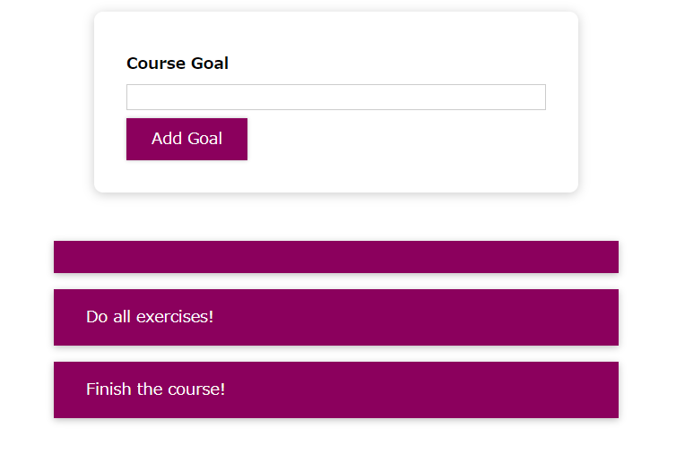
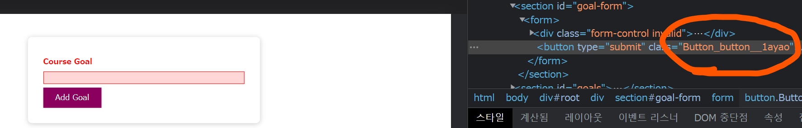

# 컴포넌트 스타일링

- 조건부 / 동적으로 컴포넌트 하는 법
- Styled Components
- Css Modules

데모 프로젝트 필요

---

## 동적 인라인 스타일




일단 가장 큰 문제는 아무것도 없는 공백에 goal을 클릭해도 공백이 추가가 된다는 것.

따라서 동적으로 스타일을 설정해줘야함


_CourseInput.js_
```js
const CourseInput = props => {
  const [enteredValue, setEnteredValue] = useState('');

  const goalInputChangeHandler = event => {
    setEnteredValue(event.target.value);
  };

  const formSubmitHandler = event => {
    event.preventDefault();
    if (enteredValue.trim().length === 0) {
      return;
    }
    props.onAddGoal(enteredValue);
  };

  return (
      ...
  );
};

export default CourseInput;

```

trim은 공백 제거. 사용자가 공백을 입력한 경우도 있으므로 이 경우를 체크.

즉 아무것도 입력하지 않을 경우 아무것도 return하지 않는다.

그러나 사용자 피드백은 없음. 따라서 이렇게 적절치 않은 입력의 경우 입력 부분에 빨간 테두리와 연한 빨강 바탕색을 추가하려함

그러므로 true, false를 체크하는 `useState`를 추가해줌.

```js
const CourseInput = props => {
  const [enteredValue, setEnteredValue] = useState('');
  const [isValid, setIsValid] = useState(true); 
  ...

  const formSubmitHandler = event => {
    event.preventDefault();
    if (enteredValue.trim().length === 0) {
      setIsValid(false);
      return;
    }
    props.onAddGoal(enteredValue);
  };

  return (
    <form onSubmit={formSubmitHandler}>
      <div className="form-control">
        <label style={{ color: !isValid ? 'red' : 'black' }}>Course Goal</label>
        <input style={{ boarderColor: !isValid ? 'red' : 'black', background: !isValid ? 'salmon' : 'transparent' }} type="text" onChange={goalInputChangeHandler} />
      </div>
      <Button type="submit">Add Goal</Button>
    </form>
  );
};
```

style에 삼항 연산자를 넣어서 true, false 값에 따라 red냐 black이냐를 정할 수 있게 됨. 

그러나 이방법은 만족스럽지 않음. 왜냐하면 inline스타일이기 때문에 css에 항상 최우선 순위를 두게 됨.

따라서 모든 스타일을 오버라이드 하게 됨.

일단은 문제 중 하나인 색상 리셋부터 설정을 하자.

```js
const CourseInput = props => {
  const [enteredValue, setEnteredValue] = useState('');
  const [isValid, setIsValid] = useState(true); 

  const goalInputChangeHandler = event => {
    if (event.target.value.trim().length > 0) {
      setIsValid(true);
    }
    setEnteredValue(event.target.value);
  };
  ...
}
```
---
## 동적 CSS 클래스

입력값이 유효하지 않을때만 클래스를 동적으로 추가하는 로직으로 짜보자.

jsx에 템플릿 리터럴을 사용하자! 싱글 따옴표가 아니라 백틱을 사용.

```js
...
return (
    <form onSubmit={formSubmitHandler}>
      <div className={
        `form-control ${!isValid ? 'invalid' : ''}`}
        >
        <label>Course Goal</label>
        <input type="text" onChange={goalInputChangeHandler} />
      </div>
      <Button type="submit">Add Goal</Button>
    </form>
  );
};
...
```
---

## Styled Component

동적 클래스도 좋은 방법이지만, 협업을 할 경우 같은 css코드에서 작업하기 때문에 이름이 중복되고 로직이 작동하지 않을 가능성이 있음.

따라서 컴포넌트에 이러한 영향을 줄이기 위해 쓰는 것이 2개가 있다.

1. **Styled Components** : 이 스타일이 첨부되는 컴포넌트에만 영향을 미치고, 다른 컴포넌트에는 전혀 영향을 미치지 않음.
2. 나중에

`Button.js`에 대해서 보자. 기본 스타일을 css를 통해 입히려고 헀다. 

```js
import React from 'react';
import styled from 'styled-components';

import './Button.css';

const Button = styled.button``;

/*
const Button = props => {
  return (
    <button type={props.type} className="button" onClick={props.onClick}>
      {props.children}
    </button>
  );
};
*/

export default Button;

```

백틱 2개 쓴것은 무엇을 의미할까? `Tagged Template Literal`! 기본적인 자바스크립트 문법임.

button은 styled객체의 메소드. 중요한 것은 여기서 전달하는 것이 결국 `Button`메소드로 간다는 것.

또한 새로운 button컴포넌트 메소드를 반환한다는 것이 재밌는 점.

이제 css에 있는 것들을 전부 옮겨와보자.

```js
const Button = styled.button`
  font: inherit;
  padding: 0.5rem 1.5rem;
  border: 1px solid #8b005d;
  color: white;
  background: #8b005d;
  box-shadow: 0 0 4px rgba(0, 0, 0, 0.26);


&:focus {
  outline: none;
}

&:hover,
&:active {
  background: #ac0e77;
  border-color: #ac0e77;
  box-shadow: 0 0 8px rgba(0, 0, 0, 0.26);
}
`;
```


&기호를 사용하면 생성한 컴포넌트에 대해 특별한 가상선택자를 사용하겠다고 패키지에게 선언하는것.

이러면 로직 구현방식은 다르지만 똑같이 작동함.

좋은 점은 자동으로 클래스를 생성해줘서 고유한 이름을 가지기 때문에 앱에 있는 다른 컴포넌트에 영향을 주지 않는다는 점!

---

## CSS 모듈

css모듈은 해당 기능을 지원하도록 설정된 프로젝트만 사용가능. 왜냐하면 브라우저에서 코드 실행이전에 코드의 변환이 필요하기 때문.

css이름을 css 앞에 .module를 붙이고, 이러한 식으로 변환하면 완료

```js
import React from 'react';

import styles from './Button.module.css';


const Button = props => {
  return (
    <button type={props.type} className={styles.button} onClick={props.onClick}>
      {props.children}
    </button>
  );
};


export default Button;
```

이러면 css에 쓰이는 class에 styles객체를 뽑아서 쓰면 됨.

또한 실제 코드에서도 `컴포넌트이름_클래스이름_고유해쉬값`식으로 이름이 지어지기 때문에 중복 문제도 없음



즉 css 모듈이 하는 일은 클래스의 이름을 css클래스나 css 파일을 가지고 고유하게 바꾸는 작업이다.

css모듈의 개념은 css파일에서 설정한 css 스타일의 범위가 한 파일에 import하는 컴포넌트에 한정된다는 것을 확실하게 해준다는 것.

---

## CSS 모듈 + 동적 + 미디어쿼리

`CourseInput.js`를 바꿔보자

_CourseInput.js_
```js
import React, { useState } from 'react';

import Button from '../../UI/Button/Button';
import styles from './CourseInput.module.css';

const CourseInput = props => {
  ...

  return (
    <form onSubmit={formSubmitHandler}>
      <div className={
        `${styles['form-control']} ${!isValid && styles.invalid}`
        }>
        <label>Course Goal</label>
        <input type="text" onChange={goalInputChangeHandler} />
      </div>
      <Button type="submit">Add Goal</Button>
    </form>
  );
};

export default CourseInput;

```

동적로직을 작성하는 것은 어렵지 않음. 백틱으로 JS로직을 넣고, &&구문으로 조건을 작동하는 로직을 넣으면 되기 때문.

참고로 css모듈을 사용할때 유효치 않은 프로퍼티 이름이면, 다른 구문을 사용하면 되는데 그것이 대괄호[] 를 사용하고 작은 따옴표로 감싸는 구문이다.

미디어 쿼리는 어떻게 작성하면 되는가?

그냥 css에 작성하면 그대로 작동한다... 