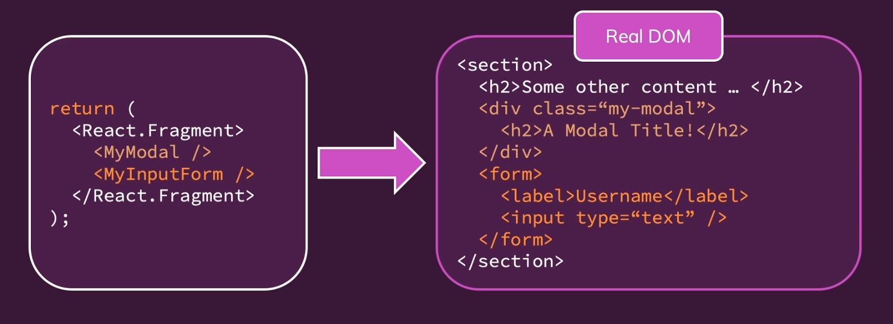
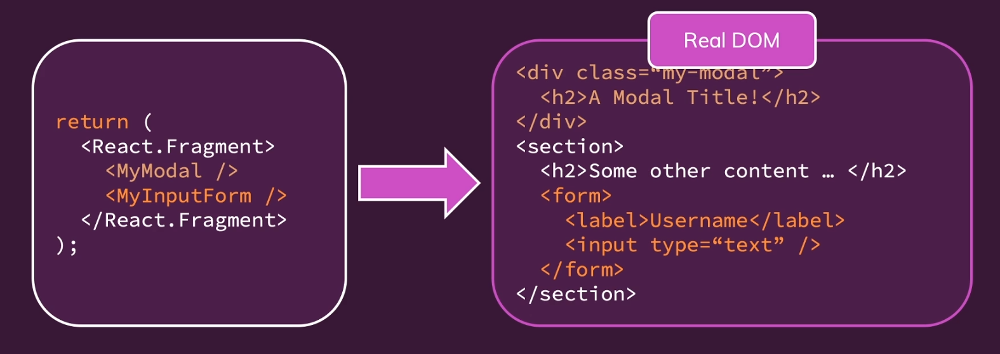
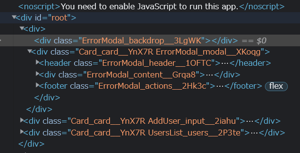
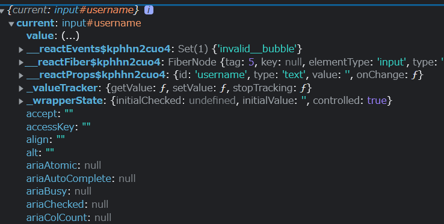

# Fragments, Portals and Refs

1. JSX의 한계와 Fragments
2. Portals을 이용한 간결한 DOM
3. Ref 사용하기

## JSX Limitations

JSX는 루트수준에서 요소들이 인접해있으면 오류가 발생함.

이런경우 

```js
return (
    <h2>안녕<h2>
    <p>반가워!<p>
);
```

이런 경우 다른 JSX요소에 의해 래핑되어야 한다. 

왜냐하면 리액트에서는 JSX에서는 1개의 root JSX 요소만 허락되기 때문 

그 이유는 유효한 자바스크립트 코드가 아니기 때문

자바 스크립트는 두 개 이상이 반환 불가능하기 때문. (2개 이상의 값인 경우 배열로 감싸줘야함.)

그러나 JSX도 이런 문제를 해결하기 위해 배열로 감싸준다면 문제가 생김

왜냐하면 모든 요소에 대해 `key`가 필요한데, 요소 하나하나마다 `key`를 표시해주는건 귀찮음.

그래서 `<div>`로 감싸주는데, 이것도 문제가 있음.

바로 `<div> soup`라는 문제. 아무런 필요가 없는데 단순히 감싸기 위해서 div로 계속 감싸게 된다는 뜻

게다가 최종적으로 사용자가 보는 HTML페이지에 수많은 div가 있어서 스타일링을 망칠 수 있고, 너무 많은 HTML 요소는 애플리케이션은 느려짐. 왜냐하면 브라우저는 모든 요소를 렌더링 하기 때문.

## Component Wrapper

`Wrapper.js`를 만들어주자

_Wrapper.js_

```js
const Wrapper = (props) => {
    return props.children;
}
export default Wrapper;
```

`props.children`은 여는태그와 닫는 태그 사이에 넣어주는 모든 내용을 담고 있음.

이 성질을 이용해서 `Wrapper.js`에 import 해 주자.

_Wrapper.js_
```js
...
import Wrapper from '../Helpers/Wrapper';
...

const AddUser = (props) => {
  ...

  return (
    <Wrapper>
    ...
    </Wrapper>
  );
};

export default AddUser;

```

이렇게 되면 `Wrapper`가 감싸게 되지만 아무것도 포함한 것 없이 그냥 반환하게 되는 로직이므로 충돌없이 반환됨과 동시에, div soup문제에도 벗어나게 된다.

---

## Fragment Component

근데 이렇게 굳이 Wrapper을 하나하나 만들 필요 없음.

리액트 자체에 Fragment라는 기능이 있음. 빈 Wrapper를 렌더링하는 기능!

예를들면 이렇게

```js
return (
    <>
        <h2>안녕<h2>
        <p>반가워!<p>
    </>
);
```
만약 작동하지 않으면 이것을 사용하면된다. 

```js
return (
    <React.Fragment>
        <h2>안녕<h2>
        <p>반가워!<p>
    </React.Fragment>
);
```

---

## React Portals 이해하기



이런 구조를 생각해보자.

무엇이 문제일까? 

모달은 페이지 위에 표시되는 오버레이임. 즉 전체페이지에 대한 오버레이

모든 것 위에 있음. 

만약 오버레이 내용이 중첩되어 있으면 스크린리더가 렌더링 되는 HTML코드를 해석할때 일반적인 오버레이를 인식하지 못할 수 있음. 

또한 이 모달이 다른 모든 내용에 대한 오버레이인지 명확하지 않음.

이러한 문제는 사이드드로어, 다이얼로그와 같은 컴포넌트에서도 발생할 수 있음.

즉 오버레이 내용이 있는 모달이 깊게 중첩되면 안되는 문제를 해결하기 위해, `Portals`를 사용하는 것.



구조가 이렇게 바뀌게 됨! 

---

## Portal 실습

우리가 사용하는 `ErrorModal.js`의 경우를 보자. 만약 그대로 실행한다면 실제 JS코드에선 어떻게 표시되는가?



ErrorModal이 Card와 나란히 있는 것을 볼 수 있다.

이걸 Portal을 통해 수정해보자.

Portal에서는 2개가 필요하다.

1. 컴포넌트를 이동시킬 장소
2. 컴포넌트에게 그곳에 컴포넌트를 가져야 한다고 알리는 것

public/body에 있는 `index.html`에 장소를 추가시키자.

```html
<html>
    ...
    <body>
        <noscript>You need to enable JavaScript to run this app.</noscript>
        <div id="backdrop-root"></div>
        <div id="overlay-root"></div>
        <div id="root"></div>
    </body>
</html>
```

이후 `ErrorModal.js`를 변화시키자.

```js
import React from 'react';
import ReactDOM from 'react-dom';

import Card from './Card';
import Button from './Button';
import classes from './ErrorModal.module.css';

const Backdrop = props => {
  return <div className={classes.backdrop} onClick={props.onConfirm} />
}

const ModalOverlay = (props) => {
  return ( 
    <Card className={classes.modal}>
        <header className={classes.header}>
          <h2>{props.title}</h2>
        </header>
        <div className={classes.content}>
          <p>{props.message}</p>
        </div>
        <footer className={classes.actions}>
          <Button onClick={props.onConfirm}>Okay</Button>
        </footer>
    </Card>
   );
}
 

const ErrorModal = (props) => {
  return (
    <>
      {ReactDOM.createPortal(
        <Backdrop onClick={props.onConfirm}/>, 
          document.getElementById('backdrop-root')
      )}
    </>
  );
};

export default ErrorModal;

```

이 로직은 `ErrorModal.js`의 로직을 사실상 둘로 쪼갠것이다.

`React-DOM`은 일종의 리액트 라이브러리고 모든 리액트 기능, state관리, 애드온, 베이크 인 등이 있다.

즉 브라우저에 대한 리액트용 어댑터가 바로 `React-DOM`

리액트 돔의 `createPortal`메소드는 두개의 인자를 받는데 하나는 렌더링 되어야 하는 리액트 노드다. 이는 JSX여야 한다.

JSX로 받기 때문에 `props.onConfirm`을 전달할 수 있다.

또 하나는 렌더링 되어야 하는 실제 DOM 컨테이너를 가리키는 포인터다. 이를 위해서 DOM API를 사용한다.

---

## Ref

우리는 폼을 제출할때만 필요한데도 키를 입력할때마다 state를 업데이트 하는건 좀 과하지 않나 생각이 들때가 있다.

그럴 때 `Ref`를 사용한다. (물론 이것만 기능이 있는게 아니다.)

ref는 마지막에 렌더링되는 HTML요소들과 다른 자바스크립트 코드간의 연결을 설정할 수 있다.

_AddUser.js_
```js
import React, { useState, useRef } from 'react';

import Card from '../UI/Card';
import Button from '../UI/Button';
import ErrorModal from '../UI/ErrorModal';
import classes from './AddUser.module.css';

const AddUser = (props) => {
  const nameInputRef = useRef();
  const ageInputRef = useRef();

  const [enteredUsername, setEnteredUsername] = useState('');
  const [enteredAge, setEnteredAge] = useState('');
  const [error, setError] = useState();

  const addUserHandler = (event) => {
    event.preventDefault();
    console.log(nameInputRef);
    if (enteredUsername.trim().length === 0 || enteredAge.trim().length === 0) {
      setError({
        title: 'Invalid input',
        message: 'Please enter a valid name and age (non-empty values).',
      });
      return;
    }
    if (+enteredAge < 1) {
      setError({
        title: 'Invalid age',
        message: 'Please enter a valid age (> 0).',
      });
      return;
    }
    props.onAddUser(enteredUsername, enteredAge);
    setEnteredUsername('');
    setEnteredAge('');
  };

  const usernameChangeHandler = (event) => {
    setEnteredUsername(event.target.value);
  };

  const ageChangeHandler = (event) => {
    setEnteredAge(event.target.value);
  };

  const errorHandler = () => {
    setError(null);
  };

  return (
    <>
      {error && (
        <ErrorModal
          title={error.title}
          message={error.message}
          onConfirm={errorHandler}
        />
      )}
      <Card className={classes.input}>
        <form onSubmit={addUserHandler}>
          <label htmlFor="username">Username</label>
          <input
            id="username"
            type="text"
            value={enteredUsername}
            onChange={usernameChangeHandler}
            ref={nameInputRef}
          />
          <label htmlFor="age">Age (Years)</label>
          <input
            id="age"
            type="number"
            value={enteredAge}
            onChange={ageChangeHandler}
            ref={ageInputRef}
          />
          <Button type="submit">Add User</Button>
        </form>
      </Card>
    </>
  );
};

export default AddUser;

```

ref의 초기 값은 정의되지 않음.

이후 HTML Elements에서 특별한 prop인 ref prop을 추가하면 됨.

이러면 리액트가 이 코드에 처음 도달해서 코드를 렌더링할 때 `nameInputRef`에 저장된 값을, name의 input을 기반으로 렌더링 된 Native DOM Element에 설정함.

이러면 `nameInputRef`안에 있는 것은 나중에 실제 DOM요소가 됨.

이것이 무엇이 좋은가? `addUserHandler` 메소드에 `nameInputRef`를 기록하는 로직을 작성했으니 확인해보자.

작성을 클릭해보자.
```js
{current: input#username}
```

무엇이 작성되는가? current가 있는 객체가 작성이 된다.

즉 ref값은 항상 객체이며, 항상 current prop을 가지고 있다.

실제로 작성된 것은 실제 DOM노드이다.



여러가지 작업이 가능하지만 조작하지 않는 것이 좋음. 왜냐하면 DOM은 React에 의해서만 조작되야 하니까.

그러면 여기서 저장된 값에 접근하려면 어떻게 해야하는가? 바로 `Ref.current.value`를 하면 된다.

이러한 사실을 통해 로직을 변경해보자.

전부 다 Ref에서 온 상수로 바꿔주고
set으로 초기화 했던 메소드들도 없애주자. 왜냐하면 더이상 초기화 할 필요가 없으니까!!

이러면 input에 썼던 `useState` 들도 더이상 필요 없어지고 없애면 된다! 

```js
import React, { useState, useRef } from 'react';

import Card from '../UI/Card';
import Button from '../UI/Button';
import ErrorModal from '../UI/ErrorModal';
import classes from './AddUser.module.css';

const AddUser = (props) => {
  const nameInputRef = useRef();
  const ageInputRef = useRef();

  const [error, setError] = useState();

  const addUserHandler = (event) => {
    event.preventDefault();
    const enteredName = nameInputRef.current.value;
    const enterdUserAge = ageInputRef.current.value;
    if (enteredName.trim().length === 0 || enterdUserAge.trim().length === 0) {
      setError({
        title: 'Invalid input',
        message: 'Please enter a valid name and age (non-empty values).',
      });
      return;
    }
    if (+enterdUserAge < 1) {
      setError({
        title: 'Invalid age',
        message: 'Please enter a valid age (> 0).',
      });
      return;
    }
    props.onAddUser(enteredName, enterdUserAge);
    nameInputRef.current.value = '';
    ageInputRef.current.value = '';
  };

  const errorHandler = () => {
    setError(null);
  };

  return (
    <>
      {error && (
        <ErrorModal
          title={error.title}
          message={error.message}
          onConfirm={errorHandler}
        />
      )}
      <Card className={classes.input}>
        <form onSubmit={addUserHandler}>
          <label htmlFor="username">Username</label>
          <input
            id="username"
            type="text"
            ref={nameInputRef}
          />
          <label htmlFor="age">Age (Years)</label>
          <input
            id="age"
            type="number"
            ref={ageInputRef}
          />
          <Button type="submit">Add User</Button>
        </form>
      </Card>
    </>
  );
};

export default AddUser;

```

코드가 많이 깔끔해진다.

그런데 재설정 로직이 사라져서 input에 계속남게 되는데 이건 어떻게 대체를 할까?

ref를 통해 DOM을 컨트롤하면된다. 그러면 안된다고 앞에 적었지만 입력한 값을 재설정하는 경우에는 허용된다. 

---

## Ref / Uncontrolled Components

ref로 값에 접근하는 경우, 입력컴포넌트는 제어되지 않는 컴포넌트가 됨.

왜 **제어되지 않는**인가? 

왜냐하면 이 컴포넌트들은 내부 state이기 때문에 안으로 반영되는 값은 리액트에 의해 제어되지 않음

따라서 input에 데이터를 새로 설정하면, (위에서 값을 새로 설정하는 경우) 리액트는 절대 다시 사용되지 않음.

ref는 사용되지만 그것은 Native DOM요소에 접근해서 일반 DOM API를 사용해서 input node를 사용하는 것이다.

따라서 리액트의 input state로 설정되지 않으므로 **제어되지 않는** 컴포넌트라고 한다. 


