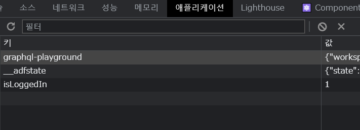

# Effect, Recucer & Context

목표

1. 이펙트 사용법
2. 복잡한 State를 Reducers를 통해 관리하기
3. 앱 수준 or 컴포넌트 수준의 컴포넌트 수준의 State를 Cotext라는 개념으로 관리하기

---

## Effect

여기서쓰이는 Effect = Side Effect

리액트 라이브러리의 임무는 UI 를 렌더링하고, 사용자 입력에 반응하여 필요할 때 UI를 재렌더링 하는것.

정리해서 말하면

- JSX 코드와 DOM을 평가(evaluate)하고, 렌더링하기
- state와 prop 관리하기
- JSX 코드와 DOM을 재평가(re-evaluate)하고 필요에 따라 실제 DOM을 조작하기

컴포넌트는 함수인데, 함수 안에 있는 모든 것들은 화면에 무언가를 가져오는 로직들이다.

사이드 이펙트는 이러한 주요 임무와 다르게 애플리케이션에서 일어나는 다른 모든 것을 뜻함

예시

- http 리퀘스트 송수신
- 브라우저 저장소에 데이터 저장
- 타이머 or 간격(interval) 설정
  
사이드 이펙트는 직접적으로 컴포넌트 함수에 들어가면 안됨.

왜냐하면 만약 리퀘스트와 관련된 이펙트가 컴포넌트에 들어갔다고 하면 함수가 실행될때마다 리퀘스트를 보내고 리퀘스트에 대한 응답으로 함수를 다시 트리거 하는 무한 루프가 발생할 가능성이 있으므로.

따라서 이것을 막기 위해 훅을 사용하는데 그게 바로 `useEffect`.

useEffect는 2개의 인수가 존재함

```js
useEffect(() => { ... }, [ dependencies ]);
```

첫번째는 **함수**

모든 컴포넌트가 평가(evaluate)된 다음 실행되어야 하는 함수이며, 지정된 의존성이 변경된 경우 실행된다.

그리고 두번째 들어가는게 그렇게 지정된 **의존성**이다.

의존성들은 배열형식으로 들어가있다. 

즉 의존성들 중 하나가 변경될때마다 첫번째 함수가 실행된다. 

또한 재렌더링될때는 실행되지 않는다.

---
## useEffect()

새 프로젝트를 만들고 더미 자격 증명으로 로그인 하는 것을 만들어 보자. 

그런데 여기서 로그인 하고 새로고침을 하면 로그인 했다는 것이 사라져 버리는데 왜냐면 `app.js`에서 `isLoggedIn`를 state로 관리하는데 이것은 하나의 js 변수다.

따라서 애플리케이션을 다시 로드할때 전체 리액트 스크립트가 다시 시작되므로, 실행에서 얻은 모든 변수는 사라지게 된다.

따라서 데이터를 저장하고, 앱이 시작될 때마다 데이터가 유지되고 있는지 확인하는 로직을 짜보자.

로컬저장소에 저장하는 방식으로 써보자.

```js
function App() {
  const [isLoggedIn, setIsLoggedIn] = useState(false);

  const loginHandler = (email, password) => {
    // We should of course check email and password
    // But it's just a dummy/ demo anyways
    localStorage.setItem('isLoggedIn', '1');
    setIsLoggedIn(true);
  };
  ...
}
```



제대로 저장이 된 모습

이제 이걸 확인하는 로직을 짜보자

```js
function App() {

  const [isLoggedIn, setIsLoggedIn] = useState(false);

  const storedUserLoggedInInformation = localStorage.getItem('isLoggedIn');

  if (storedUserLoggedInInformation === '1') {
    setIsLoggedIn(true);
  }

  const loginHandler = (email, password) => {
    // We should of course check email and password
    // But it's just a dummy/ demo anyways
    localStorage.setItem('isLoggedIn', '1');
    setIsLoggedIn(true);
  };
```

이런 방식으로 짜면 되나? 라고 생각하지만, 전에 언급한 것 처럼 이는 무한루프에 빠질 가능서이 있다. 따라서 `useEffect`를 사용해야한다.


```js
function App() {

  const [isLoggedIn, setIsLoggedIn] = useState(false);

  

  useEffect(() => {
  const storedUserLoggedInInformation = localStorage.getItem('isLoggedIn');

  if (storedUserLoggedInInformation === '1') {
    setIsLoggedIn(true);
  }
  }, []);

  const loginHandler = (email, password) => {
    // We should of course check email and password
    // But it's just a dummy/ demo anyways
    localStorage.setItem('isLoggedIn', '1');
    setIsLoggedIn(true);
  };

  const logoutHandler = () => {
    localStorage.removeItem('isLoggedIn');
    setIsLoggedIn(false);
  };
  ...
}
```

이 방식으로 짜게 되면, **모든 컴포넌트가 재평가 된 다음에 의존성이 변경되었다면 실행된다.** -> 이 지점이 중요하다.

즉 한번 실행되면 일단 `useEffect`로직이 실행이 되고, 전부 다 재평가 한 다음 **의존성이 변경 되었다면** 실행된다. 

또한 로그아웃에서 localStrage를 제거하는 것을 짰기 때문에 자동으로 지워지고, 로그아웃을 감지해낸다. 

---

## useEffect 종속성 변경

종속성을 넣어서 이펙트 함수가 앱이 시작되고 한번이 아니라 여러번 실행되는 경우를 만들어 보자.

유효성 검사의 경우에서 판단해보자. 이메일과 패스워드를 규격에 맞게 제대로 입력한 경우만 판단하는 것

이것을 useEffect로 짜보자.

_Login.js_

```js
import React, { useState, useEffect } from 'react';

import Card from '../UI/Card/Card';
import classes from './Login.module.css';
import Button from '../UI/Button/Button';

const Login = (props) => {
  const [enteredEmail, setEnteredEmail] = useState('');
  const [emailIsValid, setEmailIsValid] = useState();
  const [enteredPassword, setEnteredPassword] = useState('');
  const [passwordIsValid, setPasswordIsValid] = useState();
  const [formIsValid, setFormIsValid] = useState(false);

  useEffect(() => {
    setFormIsValid(
      enteredEmail.includes('@') && enteredPassword.trim().length > 6
    );
  }, [enteredEmail, enteredPassword])

  const emailChangeHandler = (event) => {
    setEnteredEmail(event.target.value);

  };

  const passwordChangeHandler = (event) => {
    setEnteredPassword(event.target.value);

    setFormIsValid(
      event.target.value.trim().length > 6 && enteredEmail.includes('@')
    );
  };

};

export default Login;

```

여기서 로직은 `enteredEmail`과 `enteredPassword`라는 종속성이 변경될때마다 useEffect안에 있는 `setFormIsValid`이 실행이 된다는 뜻이고, 다시 검증을 한다는 뜻이다.

그렇다면 `setFormIsValid`는 왜 종속성에 넣지 않는가?

그 이유는 state업데이트 함수는 기본적으로 리액트에 의해 절대 변경되지 않는다는 것이 보장되기 때문이다.

---

## cleanup 메소드

이렇게 짠 로직에 있어서 큰 문제가 있는데 그것은 useEffect 메소드 안에 state가 업데이트 되고 있다는 것. 이는 이상적인 구조가 아니다.

만약 이게 http 리퀘스트 보내기가 useEffect 안에 있다고 해보자. 그러면 키보드를 누를때마다 리퀘스트가 나갈 수도 있다.

마찬가지로 키보드를 누를때마다 state가 업데이트 되는 상황도 이상적이지 않다. 

이것을 막기 위해 우리는 `Debouncing`이라는 기술을 쓰자.

사용자의 입력을 Debounce(그룹화)하자는 뜻. 여기서는 사용자가 타이핑을 일시 중지했을때 하는 것.


```js
const Login = (props) => {
  const [enteredEmail, setEnteredEmail] = useState('');
  const [emailIsValid, setEmailIsValid] = useState();
  const [enteredPassword, setEnteredPassword] = useState('');
  const [passwordIsValid, setPasswordIsValid] = useState();
  const [formIsValid, setFormIsValid] = useState(false);

  useEffect(() => {
    const identifier = setTimeout(() => {
      setFormIsValid(
        enteredEmail.includes('@') && enteredPassword.trim().length > 6
      )
    }, 500);

    return () => {
      clearTimeout(identifier);
    };
  }, [enteredEmail, enteredPassword]);
}
```

여기서는 타이머를 사용해서 디바운싱을 한다. 입력을 하고 500밀리초 이후에 판단한다는 뜻.

그런데 여기서 타이머를 초기화 할 필요가있다. 초기화 하지 않으면 다음에 실행될때는 501밀리초부터 시작될 것이기 때문이다

그래서 여기서 쓰는 것이 `cleanup`메소드다. return으로 익명 애로우 함수를 쓰면 적용이 된다.

이는 이펙트를 특정한 컴포넌트가 DOM에서 마운트 해제될때마다 실행이 된다. 즉 다른 말로 하면 컴포넌트가 재사용 될때마다.

모든 새로운 사이드 이펙트 함수가 실행되기 전에, 그리고 컴포넌트가 제거되기 전에 실행된다.

---
## useReducer

state 관리를 도와주는 hook

하지만 약간 복잡하기 때문에 state를 사용하는 것이 좋고, state가 복잡할 때 Reducer를 사용하는게 좋다. 

```js
const Login = (props) => {
  const [enteredEmail, setEnteredEmail] = useState('');
  const [emailIsValid, setEmailIsValid] = useState();
  const [enteredPassword, setEnteredPassword] = useState('');
  const [passwordIsValid, setPasswordIsValid] = useState();
  const [formIsValid, setFormIsValid] = useState(false);
  ...
}
```

여기서 보면, form 자체가 하나의 커다란 state라고도 볼 수 있다. 

이 때 사용한다. 함께 속하는 state들이 있는 경우! 

함수폼 사용 규칙 중 하나는 state 업데이트가 이전 sate에 의존하는 경우에 사용한다는 것.

---

## useState vs useReducer 

useState를 사용하면 너무 번거로운 경우 useReducer를 쓴다.

### useState
- 메인 state 관리 도구
- 개별 state 및 데이터
- 간단한 state
- state 업데이트가 쉽고 몇 종류가 안되는 경우

### useReducer
- More Power
- 연관된 state 조각들로 구성된 state 관련 데이터를 다루는 경우 (ex)form input state)
- 더 복잡한 state 업데이트가 있는 경우나 state 하나를 변경하는 여러 다른 액션이 있는 경우.

---

## React Context

state를 여러 컴포넌트를 통해 전달하는 경우에서 문제가 생긴다. 기본적으로는 prop을 활용하여 다른 컴포넌트에 데이터를 전달하는데 자식의 자식에게 prop을 전달하기 위해 생기는 경우가 문제.

이렇게 직렬식이면 그나마 간단하나, 병렬적으로 연결할때는 매우매우 로직이 복잡해짐! 왜냐하면 서로 직접적으로 연결되지 않기 때문.

따라서 이 대신 실제로 필요한 데이터를 부모로부터 받는 컴포넌트에만 prop을 사용할 수 있게 로직을 짜자.

긴 prop 체인 대신!

언제 컨텍스트를 쓰고 언제 props를 쓰는가?

대부분은 props를 사용해 컴포넌트에 데이터를 전달한다.

하지만 많은 컴포넌트를 통해 전달하고자 하는 것이 있는 경우만 컨텍스트를 쓴다. 

예를 들면 매우 특정적인 일을 하는 컴포넌트나 그런 컴포넌트로 전달한느 경우에만 컨텍스트를 쓰는 것이 좋다. 

---

## Context 한계

`Button`처럼 로그아웃과 form 제출을 동시에 하는 컴포넌트의 경우 context를 적용시키기 힘들다.

또한 state 변경이 잦은 경우 적합하지 않음. (매초에 한번, 여러번 씩)

이걸 대체하기 위해서는 Redux를 쓰면 됨.


