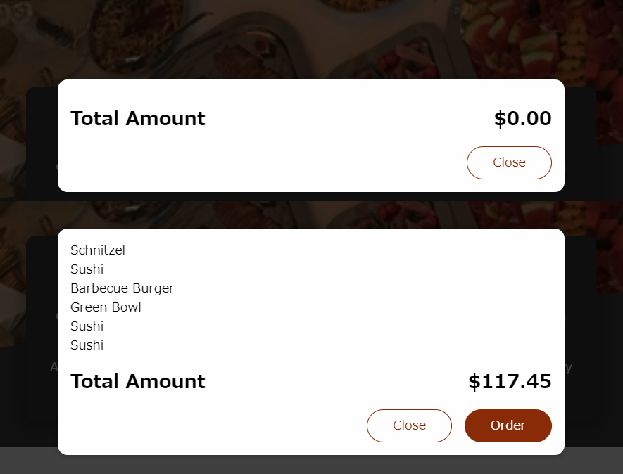
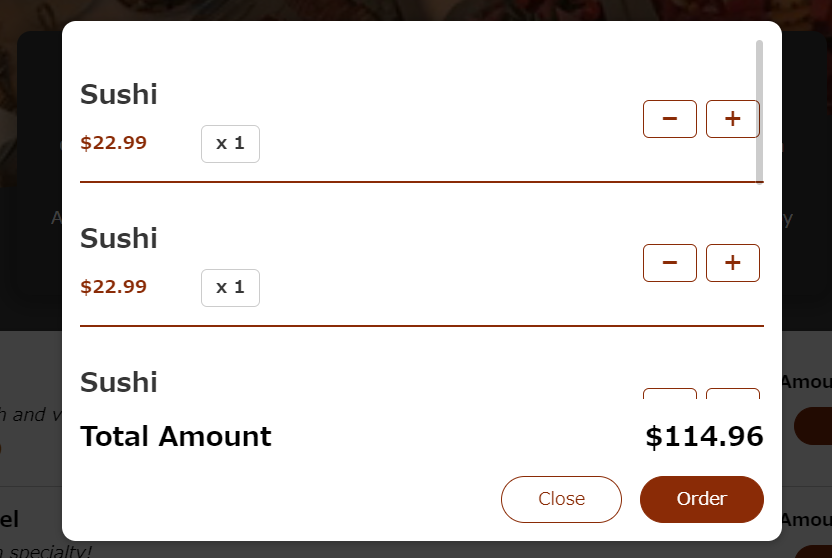

# Practice

## Header 컴포넌트 추가

`Header.js`추가 

딱 2개의 JSX코드블럭만 쓰면 된다

1. 헤더 그 자체인 툴바
2. 헤더 아래의 이미지

일단 `<Fragment>`를 Wrapper로 감싸자. 왜? JSX는 하나의 루트 요소만 반환 되어야 하는데 여기는 `header`와 `div`를 반환하기 때문

이미지 파일을 반환하는 것은 css파일을 반환하는것과 비슷하게 하고, css는 module 방식으로 import 하자.

_Header.js_
```js
import React, { Fragment } from 'react';

import mealsImage from '../../assets/meals.jpg';
import classes from './Header.module.css';

const Header = (props) => {
    return <Fragment>
        <header className={classes.header}>
            <h1>ReactMeals</h1>
            <button>Cart</button>
        </header>
        <div className={classes['main-image']}>
            
        </div>
    </Fragment>;
}
export default Header;
```

이제 이걸 `App.js`에 적용하자.

_App.js_
```js
import React, { Fragment } from "react";
import Header from "./components/Layout/Header";

function App() {
  return (
    <Fragment>
      <Header />
    </Fragment>
  );
}

export default App;
```
---

## 장바구니

먼제 헤더에 있는 버튼에 대해서 작업을 하자.

파일을 간결하게 두고 싶기 때문에 별도의 js파일을 만들어 관리를 한다. `HeaderCartButton.js`

버튼 안에는 아이콘, 텍스트, 그리고 작은 장바구니 항목수를 표시할 수 있는 작은 배지 3개가 필요하다. 따라서 3개의 `span`을 버튼 안에 감싸준다.

아이콘의 경우에는 svg아이콘을 담고 있는 js파일을 만들어준다.

_CartIcon.js_
```js
const CartIcon = () => {
    return (
      <svg
        xmlns='http://www.w3.org/2000/svg'
        viewBox='0 0 20 20'
        fill='currentColor'
      >
        <path d='M3 1a1 1 0 000 2h1.22l.305 1.222a.997.997 0 00.01.042l1.358 5.43-.893.892C3.74 11.846 4.632 14 6.414 14H15a1 1 0 000-2H6.414l1-1H14a1 1 0 00.894-.553l3-6A1 1 0 0017 3H6.28l-.31-1.243A1 1 0 005 1H3zM16 16.5a1.5 1.5 0 11-3 0 1.5 1.5 0 013 0zM6.5 18a1.5 1.5 0 100-3 1.5 1.5 0 000 3z' />
      </svg>
    );
  };
  
  export default CartIcon;
```

이 후 `HeaderCartButton.js`에 아이콘에는 `CartIcon`, 텍스트에는 Your Cart를 넣고, 장바구니 갯수를 나타내는 뱃지는 아직 로직을 짜지 못했으므로 3을 넣고 하드코딩한다.

```js
import React from 'react';

import CartIcon from '../Cart/CartIcon';
import classes from './HeaderCartButton.module.css';

const HeaderCartButton = () => {
    return <button className={classes.button}>
        <span>
            <CartIcon />
        </span>
        <span>Your Cart</span>
        <span className={classes.badge}>
            3
        </span>
    </button>;
};

export default HeaderCartButton;
```

이제 `Header.js`를 교체해주자.

```js
import React, { Fragment } from 'react';

import mealsImage from '../../assets/meals.jpg';
import HeaderCartButton from './HeaderCartButton';

import classes from './Header.module.css';


const Header = (props) => {
    return <Fragment>
        <header className={classes.header}>
            <h1>ReactMeals</h1>
            <HeaderCartButton />
        </header>
        <div className={classes['main-image']}>
            
        </div>
    </Fragment>;
}

export default Header;
```
---

## 식사 부분 추가

`Meals.js` 에서는 음식 목록과 요약 텍스트를 렌더링 한다.

여기서 2개의 컴포넌트로 나눠서 JSX로 출력하는 방식이다

1. `MealsSummary.js` : 음식 요약, 텍스트를 음식 목록 위에 렌더링함.
2. `AvailableMeals.js` : 주문 가능한 음식, 실제 음식 목록을 화면에 표시.

`MealsSummary.js`은 단순하게 하드코딩하자.

_MealsSummary.js_
```js
import classes from './MealsSummary.module.css';

const MealsSummary = () => {
  return (
    <section className={classes.summary}>
      <h2>Delicious Food, Delivered To You</h2>
      <p>
        Choose your favorite meal from our broad selection of available meals
        and enjoy a delicious lunch or dinner at home.
      </p>
      <p>
        All our meals are cooked with high-quality ingredients, just-in-time and
        of course by experienced chefs!
      </p>
    </section>
  );
};

export default MealsSummary;
```

`AvailableMeals.js`도 또한 props가 필요없이 그냥 더미데이터로 만들 예정이다. DB연동은 아직 안배웠으니...

따라서 더미 배열을 위에 추가 한 다음 이걸 출력하는 방식으로 하자

함수 안에 `map`을 사용하여 출력하는 함수를 하나 추가 하고 이것을 JSX 코드 안에 넣자. 

일단은 name만 출력하는 임시방편이다.

_AvailableMeals.js_
```js
import React from 'react';
import classes from './AvailableMEals.module.css';

const DUMMY_MEALS = [
    ...
];

const AvailableMeals = () => {
    
    const mealsList = DUMMY_MEALS.map(
        meal => <li>{meal.name}</li>
    );

    return <section className={classes.meals}>
        <ul>{mealsList}</ul>
    </section>;
}
 
export default AvailableMeals;
```

이제 이걸 `Meals.js`에 적용시키자.

_Meals.js_
```js
import React, { Fragment } from 'react';
import AvailableMeals from './AvailableMeals';

import MealsSummary from './MealsSummary';

const Meals = () => {
    return <Fragment>
        <MealsSummary />
        <AvailableMeals />
    </Fragment>;
}
 
export default Meals;
```

이제 `App.js`에 최종 적용시키자

_App.js_
```js
import React, { Fragment } from "react";
import Header from "./components/Layout/Header";
import Meals from "./components/Meals/Meals";

function App() {
  return (
    <Fragment>
      <Header />
      <main>
        <Meals />
      </main>
    </Fragment>
  );
}

export default App;
```
---
## 개별 식사 항목

`Card.js`파일을 만들자. 이것은 간단한 컴포넌트로 애플리케이션 전반에 걸쳐 다양한 위치에서 사용될 수 있는 컴포넌트다.

`props.children`을 div사이에 감싸면서, Card 컴포넌트의 div 사이에 오는 무엇이든 카드 내부에서 사용되게 됨.

_Card.js_
```js
import classes from './Card.module.css';

const Card = (props) => {
    return <div className={classes.card}>{props.childern}</div>;
}
export default Card;
```

이제 `AvilableMeal.js`에서 써주자.

_AvilableMeal.js_
```js
import React from 'react';
import classes from './AvailableMeals.module.css';
import Card from '../UI/Card';

const DUMMY_MEALS = [
    ...
];

const AvailableMeals = () => {
    
    const mealsList = DUMMY_MEALS.map(
        (meal) => <li>{meal.name}</li>
    );

    return (
    <section className={classes.meals}>
        <Card>
            <ul>{mealsList}</ul>
        </Card>
    </section>
    );
};
 
export default AvailableMeals;
```


너무 많은 컴포넌트를 나란히 두지 않기위해 MealItem폴더를 추가해서 그 안에 `MealItem.js`를 넣음

우리는 이 안에 리스트 항목을 반환한다.

왜냐하면 모든 음식 항목들은 순서가 없는 리스트로 렌더링 될 것이기 때문이다.

그리고 `<li>` 내부에는 `<div>`를 2개 넣는다.

첫번째는 이름을 반환한다. `props.name`!

name이 아니라 다른 이름도 상관 없으나 중요한 것은 부모 컴포넌트인 `AvailableMeals.js`에서 데이터를 전달하기 위해 그 이름을 사용한다는 점이다.

두번째는 설명, 세번째는 가격을 반환한다. 대신 가격은 상수로 반환하자.

상수 `price`를 설명하자면 앞에 달러표시, 그리고 동적 컨텐츠를 반환하는 $표시와 `props.price`를 소수점 2자리까지 표기하는 방법으로 나타낼 수 있다.

두번째 div에서는 사용자가 입력하는 form을 나타내는데, 이건 좀 있다 하자!

```js
import React from 'react';
import classes from './MealItem.module.css';

const MealItem = props => {
    const price = `$${props.price.toFixed(2)}`
    return (  
        <li>
            <div>
                <h3>{props.name}</h3>
                <div className={classes.description}>{props.description}</div>
                <div className={classes.price}>{price}</div>
            </div>
            <div>

            </div>
        </li>
    );
}
 
export default MealItem;
```

이제 다시 `AvailableMeals.js`를 다시 수정하자. 

임시 방편으로 적었던 map부터 수정하고, id로 접근하기 때문에 key 오류도 사라진다.

```js
import React from 'react';
import classes from './AvailableMeals.module.css';
import Card from '../UI/Card';
import MealItem from './MealItem/MealItem';

const DUMMY_MEALS = [
...
];

const AvailableMeals = () => {
    
    const mealsList = DUMMY_MEALS.map(
        (meal) => (
        <MealItem 
            key={meal.id}
            name={meal.name}
            description={meal.description}
            price={meal.price}
        />
    ));

    return (
    <section className={classes.meals}>
        <Card>
            <ul>{mealsList}</ul>
        </Card>
    </section>
    );
};
 
export default AvailableMeals;
```

## Form 추가

`MealItemForm.js` 를 수정해서 고칠 차례.

일단 기본적인 틀을 만들어주자.

_MeealItemForm.js_
```js
import React from 'react';
import classes from'./MealItemForm.module.css';

const MealItemForm = props => {
    return <form className={classes.form}>
        <input />
        <button>+ Add</button>
    </form>;
};

export default MealItemForm;
```

그리고 이것을 `MealItem.js`에 추가한다

_MealItem.js_
```js
import React from 'react';

import MealItemForm from './MealItemForm';
import classes from './MealItem.module.css';

const MealItem = props => {
    const price = `$${props.price.toFixed(2)}`
    return (  
        <li>
            <div>
                <h3>{props.name}</h3>
                <div className={classes.description}>{props.description}</div>
                <div className={classes.price}>{price}</div>
            </div>
            <div>
                <MealItemForm />
            </div>
        </li>
    );
}
 
export default MealItem;
```

이제 여기서 `input`을 많은 곳에서 재사용할 수 있게 사전에 스타일링 된 input 컴포넌트로 분리해서 만들고 싶다.

따라서 `Input.js`를 만든다. 

```js
import React from 'react';

import classes from './Input.module.css';

const Input = props => {
    return <div className={classes.input}>
        <label htmlFor={props.input.id}>{props.label}</label>
        <input id={props.input.id} {...props.input}/>
    </div>;
};

export default Input;
```

`htmlFor` prop 설정도 하는데 for 설정을 하기 위해서다.

또한 input에서도 id를 props를 통해 추가해주고, 제시되는 다른 모든 구성 데이터를 input 요소에 prop요소로 전달해준다.

이처럼 스프레드 연산자를 쓴 중괄호로 전달해주면 input 객체 에 잇는 모든 key-value 쌍은 prop으로 input에 추가된다.

예를들어 type이 text인 객체가 있는데, 그것이 prop.input으로 전해진다면 이 코드에서 type="text"가 자동으로 추가된다는 것이다. 

이제 `MealItemForm.js`에 input을 전달해보자.

여기서 중요한건 스프레드 연산자에 넣은 객체가 있어야 하므로 객체를 넣어야한다.

따라서 자바스크립트 문구를 JSX에 넣는 중괄호 하나를 넣은 다음, 객체를 나타내는 중괄호 하나를 더 넣는다.

이제 그 안에 input에 넣을 기본값들을 설정한다.

_MealItemForm.js_
```js
import React from 'react';

import Input from '../../UI/Input';
import classes from'./MealItemForm.module.css';


const MealItemForm = props => {
    return <form className={classes.form}>
        <Input label="Amount" input={{
            id: 'amount',
            type: 'number',
            min: '1',
            max: '5',
            step: '1',
            defaultValue: '1'
        }}/>
        <button>+ Add</button>
    </form>;
};

export default MealItemForm;
```
---

## 장바구니(Cart) 만들기

장바구니는 modal로 렌더링을 하자. 

장바구니의 전체 틀은 cartitems, 총 수량, 닫기 / 주문버튼 3개의 구조가 div안에 있는 구조로 짠다.

따라서 모든 cartItem 요소를 JSX 요소로 매핑하고 싶다. 하지만 아직 데이터가 없으므로 더미데이터를 쓰자.

이 더미데이터를 map을 통해 전부 JSX인 리스트로 출력하는 로직을 짠다. 이것은 나중에 `CartItem.js`로 변환될 예정이다.

이 후 배열 전체를 순서없는 리스트인 ul로 감싸주고, return의 Cart JSX 요소에 넣는다. 


## 장바구니 모달 만들기

모달 오버레이 뒤에 잇는 페이지 나머지부분과의 상호작용을 막는 기능을 넣고 싶다. 따라서 리액트 portal을 두 백드롭 모두에게 적용을 시킨다.

그리고 백드롭과 모달 오버레이 모두 컴포넌트로 구성한다. 

따라서 DOM트리 특정위치에 있는 실제 HTML요소를 렌더링하자.

_index.html_
```html
<body>
    <noscript>You need to enable JavaScript to run this app.</noscript>
    <!--이 부분을!-->
    <div id="overlays"></div>
    <!--추가했다!-->
    <div id="root"></div>
  </body>
```

따라서 이 div로 Modal과 백드롭을 Portal하는 것이다.

우리는 Overlay와 Backdrop을 둘다 나열하기 때문에 Fragment를 감싸면서 사용한다. 

Portal을 쓰기위해 `ReactDOM`을 import하고 자바스크립트 객체로 나열 한다.

그리고 써야할 컴포넌트와, div를 작성하자.

_Modal.js_

```js
import { Fragment } from 'react';
import ReactDOM from 'react-dom';

import classes from './Modal.module.css';

const Backdrop = (props) => {
  return <div className={classes.backdrop} onClick={props.onClose}/>;
};

const ModalOverlay = (props) => {
  return (
    <div className={classes.modal}>
      <div className={classes.content}>{props.children}</div>
    </div>
  );
};

const portalElement = document.getElementById('overlays');

const Modal = (props) => {
  return (
    <Fragment>
      {ReactDOM.createPortal(<Backdrop onClose={props.onClose} />, portalElement)}
      {ReactDOM.createPortal(
        <ModalOverlay>{props.children}</ModalOverlay>,
        portalElement
      )}
    </Fragment>
  );
};

export default Modal;
```

이제 Cart컴포넌트로 돌아가서 감싸는 div를 `Modal`로 바꾸자.

_Cart.js_
```js
import Modal from '../UI/Modal';
import classes from './Cart.module.css';

const Cart = (props) => {
  const cartItems = (
    <ul className={classes['cart-items']}>
      {[{ id: 'c1', name: 'Sushi', amount: 2, price: 12.99 }].map((item) => (
        <li key="{item}">{item.name}</li>
      ))}
    </ul>
  );

  return (
    <Modal onClose={props.onClose}>
      {cartItems}
      <div className={classes.total}>
        <span>Total Amount</span>
        <span>35.62</span>
      </div>
      <div className={classes.actions}>
        <button className={classes['button--alt']} onClick={props.onClose}>
          Close
        </button>
        <button className={classes.button}>Order</button>
      </div>
    </Modal>
  );
};

export default Cart;
```

이후 실제 작동하는지 보기 위햬 `App.js`에 사용해보자.

```js
import React, { useState, Fragment } from "react";
import Header from "./components/Layout/Header";
import Meals from "./components/Meals/Meals";
import Cart from "./components/Cart/Cart";


function App() {

  return (
    <Fragment>
      <Cart />
      <Header />
      <main>
        <Meals />
      </main>
    </Fragment>
  );
}

export default App;

```

---

## 장바구니 state 관리

지금 구현해야할 기능은 장바구니 버튼을 클릭했을 때만 장바구니가 표시되고 백드롭 or 닫기 버튼을 클릭하면 없어지는 기능이다.

그럴려면 state를 관리해야한다. 

`App.js`에서 useState를 import하는데 왜냐하면 장바구니를 렌더링 하는 곳이 바로 `App.js`이기 때문이다.

`cartIsShown` useState를 설정하고, 이 useState를 변경하는 함수 2개를 만들자. 

이후 이 함수들이 호출이 되는지 Cart 컴포넌트 부분을 조건부로 렌더링 해보자. 중괄호로 감싼 뒤 && 연사자를 통해 렌더링 하는 JSX 로직을 짠다.


_App.js_
```js
import React, { useState, Fragment } from "react";
import Header from "./components/Layout/Header";
import Meals from "./components/Meals/Meals";
import Cart from "./components/Cart/Cart";


function App() {

  const [cartIsShown, setCartisShown] = useState(false);

  const showCartHandler = () => {
    setCartisShown(true);
  };

  const hideCartHandler = () => {
    setCartisShown(false);
  }
  

  return (
    <Fragment>
      {cartIsShown && <Cart onClose={hideCartHandler} />}
      <Header onShowCart={showCartHandler} />
      <main>
        <Meals />
      </main>
    </Fragment>
  );
}

export default App;

```

이제 `showCartHandler`를 버튼을 누르면 보이게 만들어야 하는데, 버튼은 `Header.js`에 속해있다. 

따라서 `showCartHandler`함수는 `Header.js`에서 호출되어야 한다. 그러므로 props로 보내주자.


_Header.js_

```js
...
const Header = (props) => {
    return <Fragment>
        <header className={classes.header}>
            <h1>ReactMeals</h1>
            <HeaderCartButton onClick={props.onShowCart} />
        </header>
        <div className={classes['main-image']}>
            
        </div>
    </Fragment>;
}
...
```


Header에서는 `onClick`을 통해 props에 있는 `onShowCart` 메소드의 포인터를 지정해주고, 그 값을 `HeaderCartButton`으로 보낸다.

그런데 이런 프롭체인이 있다면 Context로 충분히 대체 가능하지만 2단계 까지 밖에 안되므로 그냥 쓰자.

_HeaderCardButton.js_
```js
import React from 'react';

import CartIcon from '../Cart/CartIcon';
import classes from './HeaderCartButton.module.css';

const HeaderCartButton = (props) => {
    return (
        <button className={classes.button} onClick={props.onClick}>
            <span className={classes.icon}>
                <CartIcon />
            </span>
            <span>Your Cart</span>
            <span className={classes.badge}>
                3
            </span>
        </button>
    );
};

export default HeaderCartButton;
```

이러면 실행이 완료된다!

---

## 장바구니 업데이트하기

여기서는 컨텍스트를 사용한다.

왜냐하면 애플리케이션 곧곧에서 장바구니가 필요하기 때문이다.

`Cart.js`의 컨텍스트부터 추가하자.

components 폴더 옆에 store폴더를 만들어 주는데, assets는 애플리케이션 전체 state 관리 이름을 store라고 지정한다.

이후 여기에 `cart-constext.js`를 만들자

_cart-constext.js_
```js
import React from 'react';

const CartContext = React.createContext({
    items: [],
    totalAmount: 0,
    addItem: (item) => {},
    removeItem: (id) => {}
});

export default CartContext;
```

일단 장바구니에 여러가지 항목을 넣을거니 items를 만들고

총액인 totalAmount를 정하고 증가옵션과 삭제옵션 메서드를 설정한다.

이후 `card-context.js` 데이터를 관리하고 컨텍스트를 접근하려는 모든 컴포넌트에 제공을 해주는 `CartProvider.js` 컴포넌트를 만들어주자.

_CartProvider.js_

```js
import CartContext from "./cart-context";

const CartProvider = props => {

    const addItemToCartHandler = item => {};

    const removeItemFromCartHandler = id => {};

    const cartContext = {
        items: [],
        totalAmount: 0,
        addItem: addItemToCartHandler,
        removeItem: removeItemFromCartHandler
    };

    return <CartContext.Provider value={cartContext}>
        {props.children}
    </CartContext.Provider>;
}
 
export default CartProvider;
```

이렇게 감싸주게 되면 이 컨텍스트에 접근해야하는 컴포넌트들이 감싸지게 되고, 컨텍스트 데이터를 관리하는 로직을 모두 이 컴포넌트에 추가할 수 있다.

따라서 모든 것이 하나의 컴포넌트에 포함되어서 다른 컴포넌트는 이걸 다룰 필요가 없어진다. 

따라서 Cart에 관련된 객체를 다시 만들어 주고, 나중에 구현될 함수의 형태도 같이 짜주자. (좀 있다 동적으로 만들거)

마지막으로 `CartContext`의 value도 `cartContext` 객체로 잡아주면 끝이다.

이제 App.js를 통해 `CartConstext`가 필요한 모든 것에 적용시켜보자.

_App.js_
```js
import React, { useState } from "react";

import Header from "./components/Layout/Header";
import Meals from "./components/Meals/Meals";
import Cart from "./components/Cart/Cart";
import CartProvider from "./store/CartProvider";


function App() {

  const [cartIsShown, setCartisShown] = useState(false);

  const showCartHandler = () => {
    setCartisShown(true);
  };

  const hideCartHandler = () => {
    setCartisShown(false);
  }
  

  return (
    <CartProvider>
      {cartIsShown && <Cart onClose={hideCartHandler} />}
      <Header onShowCart={showCartHandler} />
      <main>
        <Meals />
      </main>
    </CartProvider>
  );
}

export default App;
```

`Fragment`대신 `CartProvider`로 감싸줘서 필요한 모든 것에 적용시킬 수 있도록 했다. 

---

## 컨텍스트 헤더 적용 

useContext를 통해 `CartContext`를 전달하면 가장 가까운 Provider가 관리하게 되는데 그건 `App.js`에 있는 `CartProvider`다.

그러면 먼제 Header부터 바꾸기 위해 `HeaderCartButton.js`를 바꿔보자.

이제 useContext를 통해 컨텍스트가 변경될때마다 다시 평가가 된다. 그리고 평가를 통해 바뀌는건 Provider에서 실행이 된다. 

reduce는 데이터 배열을 값 하나로 변환해주는 메소드로, 배열 전체를 조회해야하는 length보다 절약적이다.

```js
import { useContext } from 'react';

import CartIcon from '../Cart/CartIcon';
import CartContext from '../../store/cart-context';
import classes from './HeaderCartButton.module.css';

const HeaderCartButton = (props) => {

    const cartCtx = useContext(CartContext);

    const numberOfCartItems = cartCtx.items.reduce((curNumber, item) => {
        return curNumber + item.anount;
    }, 0); 
    
    return (
        <button className={classes.button} onClick={props.onClick}>
            <span className={classes.icon}>
                <CartIcon />
            </span>
            <span>Your Cart</span>
            <span className={classes.badge}>
                {numberOfCartItems}
            </span>
        </button>
    );
};

export default HeaderCartButton;
```

---

## 장바구니 리듀서 추가

장바구니 추가 함수를 구현할 때 중요한 것은, 그 항목이 장바구니에 있는가 없는가가 중요하다. 

있으면 수량만 업데이트 하면되고, 없으면 데이터 자체를 추가해야 한다.

따라서 `CartProvider`에서 state 혹은 reducer를 추가해준다.

그리고 Reducer함수를 외부에서 구축한다. 왜냐하면 컴포넌트 내부에서 필요로 하는것이 아무것도 없을 뿐만 아니라, 컴포넌트가 재평가 될때마다 재생성 되면 안되기 때문이다.

reducer 함수에서는 state 객체와 액션을 리액트로 부터 자동으로 받는다. 

useReducer는 첫 인수는 리듀서 함수, 두번째는 초기 state다. 
또한 두개의 요소로 된 배열을 반환한다.

하나는 state 스냅샷이고 두번째는 리듀서에 액션을 전달하는 함수다.

concat은 배열에 새 항목을 추가하고 새 배열을 반환한다.

단순히 편집한다면 메모리의 기존 데이터가 편집되는 것이고 리액트는 그것을 인지하지 못한다! 

_CartProvider.js_
```js
import { useReducer } from "react";
import CartContext from "./cart-context";

const defaultCartState = {
    items: [],
    totalAmount: 0
}

const cartReducer = (state, action) => {

    if (action.type === 'ADD') {
        const updatedItems = state.items.concat(action.item);
        const updatedTotalAmount = state.totalAmount + action.item.price * action.item.amount;
        return {
            items: updatedItems,
            totalAmount: updatedTotalAmount
        }
    }
    return defaultCartState;
}

const CartProvider = props => {

    const [cartState, dispatchCartAction] = useReducer(cartReducer, defaultCartState);

    const addItemToCartHandler = (item) => {
        dispatchCartAction({type: 'ADD', item: item});
    };

    const removeItemFromCartHandler = (id) => {
        dispatchCartAction({type: 'REMOVE', id: id});
    };

    const cartContext = {
        items: cartState.items,
        totalAmount: cartState.totalAmount,
        addItem: addItemToCartHandler,
        removeItem: removeItemFromCartHandler
    };

    return (
        <CartContext.Provider value={cartContext}>
            {props.children}
        </CartContext.Provider>
    );
}
 
export default CartProvider;
```

## Refs 와 Forward Refs (장바구니 추가, 제거 로직)

이제 `addItemToCartHandler`가 호출되게 `addItem`을 호출하는 곳으로 가보자. 바로 `MealItemForm.js`

_MealItemForm.js_
```js
import React, { useRef } from 'react';

import Input from '../../UI/Input';
import classes from'./MealItemForm.module.css';


const MealItemForm = props => {

    const amountInputRef = useRef();

    const submitHandler = event => {
        event.preventDefault();
    }

    return <form className={classes.form} onSubmit={submitHandler}>
        <Input label="Amount" input={{
            id: 'amount_' + props.id,
            type: 'number',
            min: '1',
            max: '5',
            step: '1',
            defaultValue: '1'
        }}/>
        <button>+ Add</button>
    </form>;
};

export default MealItemForm;
```

먼저 event 함수를 만들고, 새로고침이 되지 않게 `preventDefault`설정을 하자.

이후 입력된 수량을 꺼내기 위해 ref를 사용하자.

하지만 사용자 정의 컴포넌트에서는 ref가 적용되지 않으므로 ref를 작성해야 하는 컴포넌트로 가서 `React.forwardRef`로 감싸자.

_Input.js_
```js
import React from 'react';

import classes from './Input.module.css';

const Input = React.forwardRef((props, ref) => {
  return (
    <div className={classes.input}>
      <label htmlFor={props.input.id}>{props.label}</label>
      <input ref={ref} {...props.input} />
    </div>
  );
});

export default Input;
```

이렇게 되면 두번째 매개변수로 컴포넌트 함수로 사용가능하다. 

이후 ref를 통해 input의 값을 담을 수 있게 된다.

이제 이것을 각각 Amount와 AmountNumber에 담아주고, 제약조건을 걸어주자.

만약 제약조건을 걸었을 때 만족하지 않으면 오류를 띄워주기 위해 state를 만들고 if문 return위에 설정하고 input 아래에도 조건을 설정한다

이후 props를 이용해 장바구니 갯수를 부모 함수에 전해주자.

_MealItemForm.js_
```js
import React, { useRef, useState } from 'react';

import Input from '../../UI/Input';
import classes from'./MealItemForm.module.css';


const MealItemForm = props => {

    const [amountIsValid, setAmountIsvalid] = useState(true);
    const amountInputRef = useRef();

    const submitHandler = event => {
        event.preventDefault();

        const enteredAmount = amountInputRef.current.value;
        const enteredAmountNumber = +enteredAmount;

        if (
            enteredAmount.trim().length === 0 || 
            enteredAmountNumber < 1 || 
            enteredAmountNumber >5
        ) {
            setAmountIsvalid(false);
            return;
        }
        
        props.onAddToCart(enteredAmountNumber);
    }

    return <form className={classes.form} onSubmit={submitHandler}>
        <Input 
            ref={amountInputRef}
            label="Amount"
            input={{
                id: 'amount_' + props.id,
                type: 'number',
                min: '1',
                max: '5',
                step: '1',
                defaultValue: '1'
        }}/>
        <button>+ Add</button>
        {!amountIsValid && <p>Please enter a valid amount</p>}
    </form>;
};

export default MealItemForm;
```

이제 부모 컴포넌트인 `MealItem.js`를 고쳐보자

`MealItemForm.js`에서 props로는 amount만 받고, 나머지는 모두 `App.js` props로 받으니 객체설정을 할때 간단히 이런식으로만 설정하면 된다.  

```js
import React,{ useContext } from 'react';

import MealItemForm from './MealItemForm';
import classes from './MealItem.module.css';
import CartContext from '../../../store/cart-context';

const MealItem = (props) => {
    const cartCtx = useContext(CartContext);

    const price = `$${props.price.toFixed(2)}`
    
    const addToCartHandler = amount => {
        cartCtx.addItem({
            id: props.id,
            name: props.name,
            amount: amount,
            price: props.price
        });
    };
    
    
    return (  
        <li>
            <div>
                <h3>{props.name}</h3>
                <div className={classes.description}>{props.description}</div>
                <div className={classes.price}>{price}</div>
            </div>
            <div>
                <MealItemForm onAddToCart={addToCartHandler}/>
            </div>
        </li>
    );
}
 
export default MealItem;
```

이제 실행해보면 제대로 실행이 된다!

---

## 장바구니 항목 출력

장바구니 항목을 출력하려면 `Cart.js`를 수정해야함

Context를 사용해야하므로 useContext를 임포트 해주자.

이제 장바구니 항목에서 더미 배열을 지우고 cartCtx.items에 접근한다. 

이제 장바구니 항목이 적절한 모습을 갖도록 하고, 항상 총수량을 출력하도록 로직을 짜자..

`totalAmount`는 소수점 이하 2자리 수만 표시하도록 하고 템블릿 리터럴에 넣는다.

그리고 주문 버튼은 장바구니에 항목이 있는 경우에만 나타나도록 하자.

_Cart.js_
```js
import { useContext } from 'react';

import Modal from '../UI/Modal';
import CartContext from '../../store/cart-context';
import classes from './Cart.module.css';

const Cart = (props) => {

  const cartCtx = useContext(CartContext);

  const totalAmount = `$${cartCtx.totalAmount.toFixed(2)}`;
  const hasItems = cartCtx.items.length > 0;
  
  const cartItems = (
    <ul className={classes['cart-items']}>
      {cartCtx.items.map((item) => (
        <li key="{item}">{item.name}</li>
      ))}
    </ul>
  );

  return (
    <Modal onClose={props.onClose}>
      {cartItems}
      <div className={classes.total}>
        <span>Total Amount</span>
        <span>{totalAmount}</span>
      </div>
      <div className={classes.actions}>
        <button className={classes['button--alt']} onClick={props.onClose}>
          Close
        </button>
        {hasItems && <button className={classes.button}>Order</button>}
      </div>
    </Modal>
  );
};

export default Cart;
```

이제 이 상태에서 아무것도 올리지 않으면 카트에 Order버튼이 없는 상태로 나타나고, 무엇이라도 올리면 올린 항목과 같이 표기가 된다. 




이제 장바구니 항목이 표시되는 방식을 작업해보자.

첨부된 `CartItem.js`를 import하고 `cartItems`에 JSX로직을 `CartItem`컴포넌트로 대체해주자. 그리고, value에 전부 map을 통해 값을 넣어주자.

이후 `CartItem.js`에는 `onRemove`와 `onAdd`로 함수 포인터를 지정하라고 값을 세팅해놨기 때문에 마찬가지로 2가지 value도 맞는 함수 포인터를 설정한다.

그리고 함수에는 bind를 호출한 다음 null과 item.id를 바인드 한다. 이렇게 되면 추가되거나 삭제된 항목의 id가 핸들러로 전달된다.

bind는 향후 실행을 위해 함수를 사전에 구성한다.

_Cart.js_
```js
import { useContext } from 'react';

import Modal from '../UI/Modal';
import CartContext from '../../store/cart-context';
import CartItem from './CartItem';
import classes from './Cart.module.css';


const Cart = (props) => {

  const cartCtx = useContext(CartContext);

  const totalAmount = `$${cartCtx.totalAmount.toFixed(2)}`;
  const hasItems = cartCtx.items.length > 0;

  const cartItemRemoveHandler = (id) => {};

  const cartItemAddHandler = (item) => {};
  
  const cartItems = (
    <ul className={classes['cart-items']}>
      {cartCtx.items.map((item) => (
        <CartItem
          key={item.id} 
          name={item.name}
          amount={item.amount}
          price={item.price}
          onRemove={cartItemRemoveHandler.bind(null, item.id)}
          onAdd={cartItemAddHandler.bind(null, item)} 
        />
      ))}
    </ul>
  );

  return (
    <Modal onClose={props.onClose}>
      {cartItems}
      <div className={classes.total}>
        <span>Total Amount</span>
        <span>{totalAmount}</span>
      </div>
      <div className={classes.actions}>
        <button className={classes['button--alt']} onClick={props.onClose}>
          Close
        </button>
        {hasItems && <button className={classes.button}>Order</button>}
      </div>
    </Modal>
  );
};

export default Cart;
```

이제 실행해보면?



모습이 보기 좋게 바뀌었다. 이제 문제는 Add, Remove의 구현과 배열 방식을 바뀌는것! (Sushi 3개가 표기되는게 아니라 * 3의 형태로.)

---

## 복잡한 리듀서

장바구니 항목을 추가하려는 로직을 변경하려면 `CartProvider.js`에서 `cartReducer`로직을 변경해야한다.

지금 항목은 항상 배열의 새 항목으로 추가되나 이것을 바꿔서 항목을 추가할때마다, 항목이 이미 장바구니에 들어있는지 확인하고, 배열의 개수를 확인하는 로직으로 바꾸자.

`existingCartItemIndex` 상수를 생성해서 장바구니에 있는 기존항목으로 가, JS 내장 메소드인 findIndex를 통해 찾는 항목이 있으면 해당 항목의 인덱스를 돌려주게 된다.

이후 `existingCartItem` 상수를 짜는데, 이는 `existingCartItemIndex`을 접근해서, 만약 장바구니에 존재한다면 index를 통해 items를 얻을 수 있을 것이고, 아니면 null이 될 것이다.

이후 새롭게 if체크를 하는데 `existingCartItem`이 있는지, 이것이 true 인지 확인함. 즉 배열에 들어있는 경우인가!

이후 수량을 업데이트 하기 위해 `existingCartItem`을 스프레드 함수로 넣고, amount를 추가해준다.

`updatedItems`는 이제 기존 항목을 복사한 새로운 배열이다. 메모리에 있는 이전 배열을 편집하지 않고 복사해서 새 배열을 만든다. 

`existingCartItemIndex`을 `updatedItems`로 감싸서, 그 값을 `updatedItem`으로 덮어 씌워 버린다. 이것은 `CartItems`재열에서 식별한 오래된 항목을 선택해 `updatedItem`으로 덮어 씌우는 것이다.

else케이스도 존재하는데 이건 항목에 없고 처음 추가되는 것으로, 그 경우에는 `updatedItem`은 그냥 처음 추가되는 것이다. 따라서 이전의 로직을 그대로 붙여주자.

_CartProvider.js_
```js
import { useReducer } from 'react';

import CartContext from './cart-context';

const defaultCartState = {
  items: [],
  totalAmount: 0
};

const cartReducer = (state, action) => {
  if (action.type === 'ADD') {
    
    const updatedTotalAmount = state.totalAmount + action.item.price * action.item.amount;

    const existingCartItemIndex = state.items.findIndex(
      (item) => item.id === action.item.id
    );

    const existingCartItem = state.items[existingCartItemIndex];


    let updatedItems;

    if (existingCartItem) {
      const updatedItem = {
        ...existingCartItem,
        amount: existingCartItem.amount + action.item.amount
      };

      updatedItems = [...state.items];
      updatedItems[existingCartItemIndex] = updatedItem;
    } else {
      updatedItems = state.items.concat(action.item);
    }

    return {
      items: updatedItems,
      totalAmount: updatedTotalAmount
    };
  }
  return defaultCartState;
};

const CartProvider = (props) => {
  const [cartState, dispatchCartAction] = useReducer(cartReducer, defaultCartState);

  const addItemToCartHandler = (item) => {
    dispatchCartAction({type: 'ADD', item: item});
  };

  const removeItemFromCartHandler = (id) => {
    dispatchCartAction({type: 'REMOVE', id: id});
  };

  const cartContext = {
    items: cartState.items,
    totalAmount: cartState.totalAmount,
    addItem: addItemToCartHandler,
    removeItem: removeItemFromCartHandler,
  };

  return (
    <CartContext.Provider value={cartContext}>
      {props.children}
    </CartContext.Provider>
  );
};

export default CartProvider;
```

---

## 아이템 이동식으로 만들기 (추가 / 삭제 버튼)

우리는 이미 `Cart.js`에서 더하기 로직을 구현했다. 따라서 `cartItemHandler`에서 cartCtx로 간 다음 addItem을 호출하고 item을 전달받으면 된다.

_Cart.js_
```js
const Cart = (props) => {

  const cartCtx = useContext(CartContext);

  const totalAmount = `$${cartCtx.totalAmount.toFixed(2)}`;
  const hasItems = cartCtx.items.length > 0;

  const cartItemRemoveHandler = (id) => {};

  const cartItemAddHandler = (item) => {
    cartCtx.addItem({...item, amount: 1});
  };
  ...
};
```

하지만 삭제는 구현하지 않았으므로 삭제를 구현하러 `CartProvider.js`를 가서 리듀서를 손보자.

cartRecucer 안에 action.type이 REMOVE와 같은지 체크하는 if문을 하나 만들어 주자. 

우리가 만드려는 로직은 기본적으로는 업데이트와 같다. 왜냐하면 수를 하나씩 줄이면서 업데이트 하는것이기 때문이다. 하지만 수량이 1개밖에 남지 않은 경우에는 이것을 완전히 삭제해줘야 한다.

따라서 이는 전에 만들었던 없으면 추가하고, 있으면 수만 높이는 로직과 굉장히 유사하다.

filter를 통해 삭제해주는 로직을 만들고 else를 통해 수량만 낮추는 로직은 추가 업데이트와 동일하게 짜준다

_CartProvider.js_
```js
import { useReducer } from 'react';

import CartContext from './cart-context';

const defaultCartState = {
  items: [],
  totalAmount: 0,
};

const cartReducer = (state, action) => {
  if (action.type === 'ADD') {
    const updatedTotalAmount =
      state.totalAmount + action.item.price * action.item.amount;

    const existingCartItemIndex = state.items.findIndex(
      (item) => item.id === action.item.id
    );
    const existingCartItem = state.items[existingCartItemIndex];
    let updatedItems;

    if (existingCartItem) {
      const updatedItem = {
        ...existingCartItem,
        amount: existingCartItem.amount + action.item.amount,
      };
      updatedItems = [...state.items];
      updatedItems[existingCartItemIndex] = updatedItem;
    } else {
      updatedItems = state.items.concat(action.item);
    }

    return {
      items: updatedItems,
      totalAmount: updatedTotalAmount,
    };
  }
  if (action.type === 'REMOVE') {
    const existingCartItemIndex = state.items.findIndex(
      (item) => item.id === action.id
    );
    const existingItem = state.items[existingCartItemIndex];
    const updatedTotalAmount = state.totalAmount - existingItem.price;
    let updatedItems;
    if (existingItem.amount === 1) {
      updatedItems = state.items.filter(item => item.id !== action.id);
    } else {
      const updatedItem = { ...existingItem, amount: existingItem.amount - 1 };
      updatedItems = [...state.items];
      updatedItems[existingCartItemIndex] = updatedItem;
    }

    return {
      items: updatedItems,
      totalAmount: updatedTotalAmount
    };
  }

  return defaultCartState;
};

const CartProvider = (props) => {
  const [cartState, dispatchCartAction] = useReducer(
    cartReducer,
    defaultCartState
  );

  const addItemToCartHandler = (item) => {
    dispatchCartAction({ type: 'ADD', item: item });
  };

  const removeItemFromCartHandler = (id) => {
    dispatchCartAction({ type: 'REMOVE', id: id });
  };

  const cartContext = {
    items: cartState.items,
    totalAmount: cartState.totalAmount,
    addItem: addItemToCartHandler,
    removeItem: removeItemFromCartHandler,
  };

  return (
    <CartContext.Provider value={cartContext}>
      {props.children}
    </CartContext.Provider>
  );
};

export default CartProvider;
```

이제 `Cart.js`에 로직을 넣자.

_Cart.js_
```js
const Cart = (props) => {

  const cartCtx = useContext(CartContext);

  const totalAmount = `$${cartCtx.totalAmount.toFixed(2)}`;
  const hasItems = cartCtx.items.length > 0;

  const cartItemRemoveHandler = (id) => {
    cartCtx.removeItem(id);
  };

  ...
}
```
---

## useEffect 훅 (애니메이션 효과)

장바구니에 항목을 추가하거나 항목을 삭제하거나 항목의 수량을 변경할때마다 애니메이션 효과를 주고싶다

따라서 버튼 상수를 추가해 준다음, css를 씌워주고 조건부로 실행하게 해보자.

따라서 이펙트 함수를 추가하고 의존성 배열도 설정하는 것을 잊지 말자.

우리는 버튼 클래스가 bump하는 애니메이션을 클래스를 포함하도록 바꾸고 이후 그 클래스를 다시 삭제하는 타이머를 설정하고 싶다. 또한 다시 추가되면 또 다시 재생되고...

따라서 useState도 추가한다. 조건부니까!

이후 useEffect함수에서 set으로 useState를 추가한 다음 true로 설정한다. 이후 btnClasses에서는 useState의 값이 true인지 확인하고 class를 바꿔주게 한다. 아니면 그냥 빈문자로 css가 적용되지 않는다.

또한 이건 장바구니에 항목이 하나 이상 있는 경우에만 실행되어야 하므로 의존성을 추가하는데, cartCtx로 할 경우 cartCtx가 바뀔대마다 다시 실행되므로, 객체 디스트럭처링을 사용해서 불러온다.

이 경우 장바구니에서 items를 꺼내오게 되고, 전체 컨텍스트가 아니라 items 배열만 이 이펙트 함수의 의존성이 되게 된다. 

이후 timer를 짜 주고, 사이드 이펙트를 정리하는, 즉 클린업 함수 로직을 짠다. 

_HeaderCartButton.js_
```js
import { useContext, useEffect, useState } from 'react';

import CartIcon from '../Cart/CartIcon';
import CartContext from '../../store/cart-context';
import classes from './HeaderCartButton.module.css';

const HeaderCartButton = (props) => {

  const [btnIsHighlighted, setBtnIsHighlighted] = useState(false);
  const cartCtx = useContext(CartContext);

  const { items } = cartCtx;

  const numberOfCartItems = items.reduce((curNumber, item) => {
    return curNumber + item.amount;
  }, 0);

  const btnClasses = `${classes.button} ${btnIsHighlighted ? classes.bump : ''}`;

  useEffect(() => {
    if (items.length === 0) {
      return;
    }
    setBtnIsHighlighted(true);

    const timer = setTimeout(() => {
      setBtnIsHighlighted(false);
    }, 300);

    return () => {
      clearTimeout(timer);
    };
  }, [items]);

  return (
    <button className={btnClasses} onClick={props.onClick}>
      <span className={classes.icon}>
        <CartIcon />
      </span>
      <span>Your Cart</span>
      <span className={classes.badge}>{numberOfCartItems}</span>
    </button>
  );
};

export default HeaderCartButton;
```