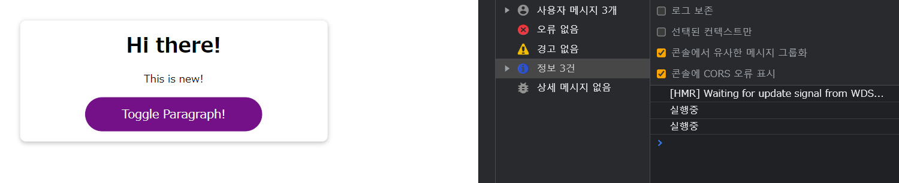

# React Work Behind And Background

## 목적

1. 리액트의 백그라운드 작업 : 어떻게 컴포넌트와 연동이 되는가, 어떻게 컴포넌트를 업데이트 하는가...
2. 가상 DOM: 가상 DOM이란 무엇이고 어떻게 작동한는가? 실제 DOM에는 어떤 영향을 주는가?
3. 상태 객체: 리액트가 이를 어떻게 관리하고 갱신하는가?

---


## 리액트는 어떻게 움직이는가?

리액트의 핵심은 컴포넌트이지만, 또 중요한 개념은 **ReactDOM**이다.

`ReactDOM`은 웹에 대한 인터페이스

리액트는 컴포넌트를 다루는 방법은 아는데, 웹에 대해서는 모름. 즉 컴포넌트에 HTML요소가 뭐가 포함되어 있는지, 허구의 HTML요소인지 이런거는 판단을 못함.

단순히 변경된 내용과 어떤 화면이든 간에 화면에 표시되어야할 정보 모두를 인터페이스에 전달하는 역할이 바로 리액트의 역할.

그 인터페이스 중 하나가 바로 `ReactDOM`이며, 실제 DOM과 연결되어 있다.

컴포넌트와 실제 DOM과의 통신에 실질적으로 작동하는 원리에는 리액트가 하는 역할이 숨겨져 있다. 바로 가상 DOM을 사용하는 것.

가상 DOM은 앱이 마지막에 만들어내는 컴포넌트 트리를 결정한다. 

만약 State가 업데이트 되면, 이 정보가 리액트DOM에 전달되어 갱신 전후의 State 차이를 인식해 리액트가 컴포넌트 트리를 통해 구성한 가상 스냅샷인 가상DOM과 일치하도록 실제 DOM을 조작하게 됨.

State, props, 컨텍스트, 컴포넌트 변경이 있을 때 리액트가 재평가하는 것은, DOM을 재렌더링한다는 것과 동치가 아니다.

**리액트에 의해 컴포넌트 함수가 재실행된다고 해도, 실제 DOM의 각 부분들이 다시 렌더링된다거나 재평가 되는 것이 아님.**

따라서 컴포넌트 부분, 리액트 부분, 실제 DOM을 잘 파악해야함. 

- 컴포넌트 부분: **State, props, 컨텍스트, 컴포넌트 변경이 있을때 재평가됨.** 이러면 리액트는 컴포넌트 함수를 재실행함.
- 실제 DOM: 리액트가 구성한 컴포넌트의 이전상태와 Tree, 그리고 현재의 상태간의 **차이점을 기반**으로, 변경이 필요할때만 업데이트 된다. 

이 지점은 성능과도 연결이 됨. 이전과 현재상태를 가상으로 비교하는것은 메모리 안에서 발생하기 때문에 간편하고 자원이 적게 듦.

반면 실제 DOM을 사용하면 자원이 많이 들고 성능부하가 발생하게 됨.

---
## 컴포넌트 업데이트 실행중

리액트는 state, props, context 등의 변경시에만 함수를 재실행하고 재평가함.

그런데 props를 생각하면 부모에서 자식 컴포넌트로 향하는 과정이다. 그러면 props를 통해 넘겨받은 값은 언제 바뀌는가?

결론부터 말하면 부모의 상태가 다른 상태로 바뀌었을 경우에만 바뀐다.

이걸 알아보기 위해 `App.js`를 만져보자.

useState를 정한 다음, true 일 경우만 jsx코드를 등장시키는 JS로직을 컴포넌트의 return문 안에 넣는다.

이후 `Button`을 넣고, 

함수를 짜는데, `setShowParagraph`안에 `showParagraph`을 넣고, 이것의 반대값으로 만드는 로직으로 짠다. 

_App.js_
```js
import React, { useState } from 'react';
import Button from './components/UI/Button/Button';

import './App.css';

function App() {
  const [showParagraph, setShowParagraph] = useState(false);

  console.log('실행중');

  const toggleParagraphHandler = () => {
    setShowParagraph((prevShowParagraph) => !prevShowParagraph);
  }

  return (
    <div className="app">
      <h1>Hi there!</h1>
      {showParagraph && <p>This is new!</p>}
      <Button onClick={toggleParagraphHandler}>Toggle Paragraph!</Button>
    </div>
  );
}

export default App;
```

이제 실행을 해보자.


먼저 실행할때 한번 컴포넌트 함수를 실행 시키고




이후 버튼을 누를때마다 재실행이 된다. 왜냐하면 state가 변경되었기 때문. 따라서 ReactDOM으로 해당 정보가 전달이 되고 이러한 변경점이 화면에 렌더링된 결과로 표시가 된다.

즉 state가 변경될때마다 컴포넌트 전체가 재실행되고 재평가 된다.

그러면 실제 DOM엔 어떤 변경이 있을까?

실제 실행을 하면 반짝이는 부분만 변경되는데, `<div>`부분이나 `<p>`부분만 반짝이는 걸보면, **다른 부분은 렌더링 되지 않고, 스냅샷간의 차이점만 반영이 된다.**

---

## 자식 컴포넌트 재평가

Component 폴더 안에 Demo폴더를 추가한 뒤 안에 `DemoOutput.js`를 만든다.

이후 `App.js`의 조건부 부분을 `DemoOutput`으로 수정한다.

```js
...
function App() {
    ...

  return (
    <div className="app">
      <h1>Hi there!</h1>
      <DemoOutput show={showParagraph}/>
      <Button onClick={toggleParagraphHandler}>Toggle Paragraph!</Button>
    </div>
  );
}
export default App;
```
`DemoOutput.js`는 단락을 조건부로 렌더링해야하므로 props를 받은 데이터를 기반으로 한다. 

_DemoOutput.js_
```js
import React from 'react';

const DemoOutput = (props) => {
    console.log('데모 실행중');
    return <p>{props.show ? '짜잔!' : ''}</p>;
}
export default DemoOutput;
```

이제 실행해보고 실제 DOM이 어떻게 바뀌는지 보자.


항상 `<p>`부분은 비워져있고, 버튼을 클릭할때 이 부분만 변하며 깜빡이며 등장한다.

흥미로운 것은 App 컴포넌트의 state가 계속 바뀌지만, 실제로 바뀌는 것은 다른 컴포넌트의 일부분이다. 즉 리액트가 계속 비교작업과 업데이트를 하고, 변경점을 찾아낸다는 것!

결론적으로는 `DemoOutPut.js`에서의 props.show에서 얻을 수 있는 value는 `ShowParagraph`의 state에서 관리하는 값이고, 이건 결론적으로 리액트에서 state와 state의 변화로 이어진다.


버튼을 눌러도 둘다 항상 재실행 되고 있음을 알 수 있다.

이제 조금 꼬아보자. `App.js`에서 `DemoOutPut.js`에게 주는 value를 항상 false로 가게 하드코딩 해보자.


_App.js_
```js
...
return (
    <div className="app">
      <h1>Hi there!</h1>
      <DemoOutput show={false}/>
      <Button onClick={toggleParagraphHandler}>Toggle Paragraph!</Button>
    </div>
  );
...
```

그 다음에 버튼을 눌러보면?


계속 둘 다 console에 출력이 된다! props는 바뀌는게 없는데! 왜 그럴까?

그 이유는 부모 함수에서 재평가/재실행을 할때, 자식 컴포넌트도 재평가/재실행을 하기 때문!

즉 props의 변경은 실제 DOM의 변경으로 이어질 수 있지만, 함수에서 재평가를 할때는 부모 컴포넌트가 재평가되는 것으로 충분하다.

또한 마찬가지로 자식의 자식 컴포넌트가 있다면 그것 또한 재평가가 된다.

---

## react.memo

이런 경우, 이렇게 간단한 앱일때는 문제가 없지만, 대형프로젝트일 경우, 최적화가 필요하다. 

따라서 리액트는 특정 상황일때만 자식 컴포넌트를 재평가하는 로직을 짤 수 있다.

props가 바뀌었는지 확인할 컴포넌트를 지정한 뒤에 이를 Wrapping해주면 끝이다.

```js
import React from 'react';

const DemoOutput = (props) => {
    console.log('데모 실행중');
    return <p>{props.show ? '짜잔!' : ''}</p>;
};

export default React.memo(DemoOutput);
```

이렇게! 

React.memo는 인자로 들어간 이 컴포넌트에 어떤 props가 입력되는지 확인하고 입력되는 모든 props의 신규 값을 확인한 뒤 이를 기존의 props의 값과 비교하도록 리액트에게 전달함.

그 때 props의 값이 바뀐경우만 컴포넌트를 재실행 및 재평가하게됨. 만약 props 값이 바뀌지 않으면 컴포넌트는 재실행 되지 않음.


이렇게 확인이 됨!

그러면 이제 모든 것에 다 memo를 wrapping하면 되는가? 그건 또 아니다. 왜냐하면 memo 메소드는 App에서 변경이 발생할때마다 컴포넌트로 이동하여 기존 props 값과 새 값을 비교 하게됨.

그러면 리액트가 2개의 작업을 해야할 공간이 필요하고 비교하는 작업도 필요하게 된다. 

따라서 **컴포넌트를 재평가하는데 필요한 성능비용 vs props를 비교하는 성능비용**으로 결정하게 되는데, 이는 props의 갯수, 컴포넌트의 복잡도, 자식컴포넌트의 숫자 등등으로 결정된다.

예를들어 만약 상속이 많은 컴포넌트라면 memo를 하는게 이득일 것이다. 

하지만 반대로 부모 컴포넌트를 재평가할때마다 컴포넌트의 변화가 있거나 props가 변화할 가능성이 있다면 이는 하지 않는 것이 이득이다.

그러면 `Button.js`에 대해서 평가해보자. 이것은 트리거 컴포넌트로, 항상 같은 텍스트, 같은 함수를 사용하기 때문에 재평가 할 필요가 없다. 따라서 이를 memo로 Wrapping하자.


_Button.js_
```js
import React from 'react';

import classes from './Button.module.css';

const Button = (props) => {
  console.log('버튼 작동');
  return (
    <button
      type={props.type || 'button'}
      className={`${classes.button} ${props.className}`}
      onClick={props.onClick}
      disabled={props.disabled}
    >
      {props.children}
    </button>
  );
};

export default React.memo(Button);
```

이제 이걸 실행하면?


재밌게도 `Button.js`가 재평가 되고 있다는게 나타난다. 왜 이럴까?

이건 즉 prop이 계속 바뀐다는 뜻인다, prop의 값과 함수는 항상 불변인 상태다.

_App.js_
```js
...
return (
    <div className="app">
      <h1>Hi there!</h1>
      <DemoOutput show={false}/>
      <Button onClick={toggleParagraphHandler}>Toggle Paragraph!</Button>
    </div>
  );
...
```

이건 리액트에서 흔하게 발생하는 오류 중 하나인데, 컴포넌트도 하나의 JS함수이기 때문이다.

이것들은 하나의 상수로 이루어진 함수로, 리액트에 의해 재호출 되게 된다면, 다시 실행이 된다. 즉 **모든 실행사이클에서 컴포넌트 내의 함수들은 항상 완전히 새로운 함수다.**

그런데 다시 생각해보면 `<DemoOutput show={false}/>` 안의 false값도 항상 재생성 되는데 왜 이건 먹힐까?

그 이유는 false는 Boolean값으로 원시형이기 때문에 memo를 통해 비교를 할때 메모리 안에 있는 이전의 값과 같다고 인식을 할 수 있다.

하지만 배열이나 객체, 함수를 비교한다면 JS입장에서는 이것은 같지가 않다.

```js
false === false;
// true
'hi' === 'hi';
// true
[1,2,3] === [1,2,3];
// false. 객체, 함수도 마찬가지!
```
이렇다는 뜻! 

---

## useCallback()으로 함수 재생성 방지.

위의 문제를 해결해보자.

`useCallback` 훅은 컴포넌트 실행 전반에 걸쳐 함수를 저장할 수 있게 하는 훅으로, 리액트에, 우리는 이 함수를 저장할 것이고 매번 실행때마다 이 함수를 재생성할 필요가 없다는걸 알릴 수 있다.

이 훅이 하는일을 풀어서 설명해보자.

```js
let obj1 = {};
let obj2 = {};

obj1 === obj2;
// false

obj2 = obj1;

obj1 === obj2;
// true
```

이런 일을 `useCallback`훅이 한다는 것!

선택한 함수를 리액트의 내부저장공간에 저장해서 함수객체가 실행될 때마다 이를 재사용할 수 있게 만든다.

useCallback은 단순히 함수를 감싸면 되지만, 의존성 배열 또한 필요하다. 

하지만 `App.js`의 `toggleParagraphHandler`의 경우, 간단하고, 이전과 동일한 함수객체임이 보장됨으로 빈 배열만 놓는다.

```js
...
function App() {
  const [showParagraph, setShowParagraph] = useState(false);

  console.log('실행중');

  const toggleParagraphHandler = useCallback(() => {
    setShowParagraph((prevShowParagraph) => !prevShowParagraph);
  }, [])
  ...
}

export default App;
```
이제 실행해 보면?


재실행이 안됨을 알 수 있다!

---
## useCallback 과 종속성

그렇다면 의존성 배열은 왜 필요할까? 내 함수는 모든 재렌더링 주기마다 항상 같은 로직을 쓰는데?

일단 그것을 이해하려면 [클로저(Closusre)](https://developer.mozilla.org/ko/docs/Web/JavaScript/Closures)라는 개념부터 알고 있어야 한다.

이 개념을 사용하기 위해 `App.js`에 두번째 버튼을 만들고, 버튼의 로직은 토글기능을 활성화해서 다른 버튼이 작동되게 하는 로직으로 짜자.

따라서 Toggle을 핸들링하는 함수를 짜고, 이 함수는 토글값을 토글하지 않고, 다른 버튼에 대한 토글을 활성화 한다.

따라서 `toggleParagraphHandler` 함수에도 if문을 넣어서 `allowToggle`이 true일 경우만 실행되게 useCallback 함수를 다시 짠다.

_App.js_
```js
import React, { useState, useCallback } from 'react';
import Button from './components/UI/Button/Button';
import DemoOutput from './components/Demo/DemoOutput';

import './App.css';

function App() {
  const [showParagraph, setShowParagraph] = useState(false);
  const [allowToggle, setAllowToggle] = useState(false);

  console.log('실행중');

  const toggleParagraphHandler = useCallback(() => {
    if (allowToggle) {
      setShowParagraph((prevShowParagraph) => !prevShowParagraph);
    }
    
  }, [])

  const allowToggleHandler = () => {
    setAllowToggle(true);
  };

  return (
    <div className="app">
      <h1>Hi there!</h1>
      <DemoOutput show={showParagraph} />
      <Button onClick={allowToggleHandler}>Allow Toggling!</Button>
      <Button onClick={toggleParagraphHandler}>Toggle Paragraph!</Button>
    </div>
  );
}

export default App;
```

이렇게 앱을 짜면 어떻게 될까? 정상적이었다면 Allow Toggling! 버튼을 클릭하고 Toggle Paragraph! 를 누르면 그냥 실행되어야 하지만, 실제 콘솔창을 보면 아무것도 실행되지 않는다. 


그 이유는 자바스크립트에서 함수는 클로저이고, useCallback은 제대로 활용하지 않아서다.

즉 함수가 정의가 되면, (여기서는 useCallback 안에 있는 함수) 정의된 함수 외부에서 사용하는 모든 변수를 잠그게 된다.

여기서는 `allowToggle`이 그 변수가 되고, 자바스크립트는 이 `allowToggle`에 클로저를 만들고, 함수를 정의할때 사용하기 위해 저장한다.

이렇게 되면, 다음에 `toggleParagraphHandler`가 실행이 되면 이 저장된 상수를 그대로 사용함.

따라서 이 `allowToggle`의 값은 저장된 시점의 값을 사용하게 됨.

이 기능은 사실 매우 좋은 기능이다. 왜냐하면 우리가 `Button`에 함수를 바인딩했던것 처럼 원하는 시점에 함수를 호출 가능하기 때문이다.

그러나 이 경우에서는 우리가 useCallback을 사용하여 리액트에게 해당 함수를 저장하라고 지시한다. 

따라서 `toggleParagraphHandler` 가 받고 있는 이 함수는 재평가 / 재실행 되지 않는다. 

따라서 `allowToggle`의 값은 최신의 값이나 갱신된 값이 아니라, 처음 실행된 시점의 값만을 저장하게 되는 것이다. 

따라서 이처럼 함수 재생성이 필요로 하는 경우가 있을 수 있다. 왜냐하면 함수 외부에서 오는 값이 변경되었을 수 있기 때문.

따라서 의존성 배열에 allowToggle을 넣는다. 이렇게 된다면 allowToggle의 값이 바뀌고 새 값이 들어오면 리액트는 함수를 재생성하고 새로만든 함수를 저장하게 된다.

따라서 이렇게 바꾸면? 

_App.js_
```js
import React, { useState, useCallback } from 'react';
import Button from './components/UI/Button/Button';
import DemoOutput from './components/Demo/DemoOutput';

import './App.css';

function App() {
  const [showParagraph, setShowParagraph] = useState(false);
  const [allowToggle, setAllowToggle] = useState(false);

  console.log('실행중');

  const toggleParagraphHandler = useCallback(() => {
    if (allowToggle) {
      setShowParagraph((prevShowParagraph) => !prevShowParagraph);
    }
    
  }, [allowToggle])

  const allowToggleHandler = () => {
    setAllowToggle(true);
  };

  return (
    <div className="app">
      <h1>Hi there!</h1>
      <DemoOutput show={showParagraph} />
      <Button onClick={allowToggleHandler}>Allow Toggling!</Button>
      <Button onClick={toggleParagraphHandler}>Toggle Paragraph!</Button>
    </div>
  );
}

export default App;

```

정상적으로 실행이 된다! 

---

## State와 재실행

App함수가 재실행된다면, useState또한 재실행된다는 것인데 이것이 State의 초기화를 불러일으키지는 않을까? 근데 실제 보면 그렇지 않음. 

그렇다면 왜? useState는 리액트가 제공하고,  컴포넌트와의 연결을 관리하기 때문.

이 관리 프로세스의 일부로 리액트는 useState와 여기에 전달된 기본값에 대해서는 한번만 고려되도록 처리함. 즉 컴포넌트가 처음 렌더링 될 때.

이후 리액트는 컴포넌트에 어떤 State 변수가 있는지 저장을 해놓음.

만약 재평가 하는 과정에서 State가 호출되었다면 새로운 State는 생성되지 않음. 왜냐하면 리액트는 이 컴포넌트에 대한 State가 이미 존재한다는 것을 깨달았기 때문. 대신 Update를 함.

즉 **리액트는 State의 관리와 Update만 담당함.** DOM에 컴포넌트가 연결되고 유지되는 동안에는 State는 최초의 초기화 이후에는 갱신만 된다.

---

## State Update & Scheduling

`Scheduled State Change`에서 리액트는 이를 인지하고 있고 처리할 계획을 준비하지만 즉시 처리하지 않음. 

대신 업데이트 함수를 호출하면, 변화 시키려는 값으로 state를 업데이트 하게끔 예약을 한다. 이것이 바로 `Scheduled State Change`

이런 예약과 변경과정은 매우 빨라서 거의 즉각적이나, 리액트는 사실은 State의 변화를 지연시킨다.

이후 새로운 State가 활성화 되어서 State 변화가 처리되면 리액트는 컴포넌트를 재평가하고 컴포넌트 함수를 재실행한다.

이러한 Scheduling 때문에, 다수의 Scheduled State Change가 동시에 있을 수 있다. 이 경우, **비동기적으로 업데이트 하게 된다.** 

왜냐하면 state가 변경되때마다 렌더링이 되므로, 한꺼번에 여러번 state가 변경되면 많은 렌더링이 발생하기 때문. 따라서 state의 변경사항을 즉시 반영치않고 대기열에 넣은 다음 한번에 적용 시킴. 

이 과정에서 setState 호출 이후, state의 값이 개발자가 의도치 않는 값이 될 수도 있기 때문에, **동시에 state를 여러개 업데이트 할 경우, state를 batching(객체로 합치는 과정)하여 진행함.**

그런데 이전의 이 경우를, 만약 함수형을 쓰지 않고 set에 js로직을 넣어서 굴린다고 생각해보자.

```js
const [showParagraph, setShowParagraph] = useState(false);

const toggleParagraphHandler = () => {
  setShowParagraph(!showParagraph);
}
```

이 경우 `toggleParagraphHandler`가 실행될때마다 `showParagraph`에 반대으로 업데이트 하는 경우로, 이전의 로직과 동일하다.

그러나 이러한 코드는 언제나 반대값으로 업데이트가 되는 것을 보장하지 못한다. 비동기적으로 state값이 업데이트 되다보니 다른 코드와 사용할 경우 side effect가 생길 가능성이 농후하다.

이 경우 보완하는게 바로 `setState`에 함수형으로 값을 넣는것. 이러면 값을 전달하는 것이 아니라 함수를 전달하게 된다.

```js

const [showParagraph, setShowParagraph] = useState(false);

const toggleParagraphHandler = () => {
  setShowParagraph((prevShowParagraph) => !prevShowParagraph);
}
```

즉 이처럼 `이전의 state 값을 반대로 바꾸는 함수`를 넣기 때문에, batching되어서 대기열에 있어도 사이드 이펙트 없이 제대로 실행됨을 보장한다.

따라서 State를 업데이트 할때는 함수형태를 이용해서 Update하는 것이 좋고, 특히 이전 State의 Snapshot에 의존해야한다면 더더욱 그래야한다.

우리가 useEffect를 배울때도, state 혹은 종속된 값이 변경될 때마다 의존성 매커니즘을 통해 내부에서 선언한 이펙트가 재실행되게 하므로, 이와 비슷하다.

출처: [useState](https://velog.io/@iamjoo/useState)


---

## useMemo 최적화

useMemo는 useCallback과 비슷한데 함수 대신 배열, 객체를 넣는다는 점.


