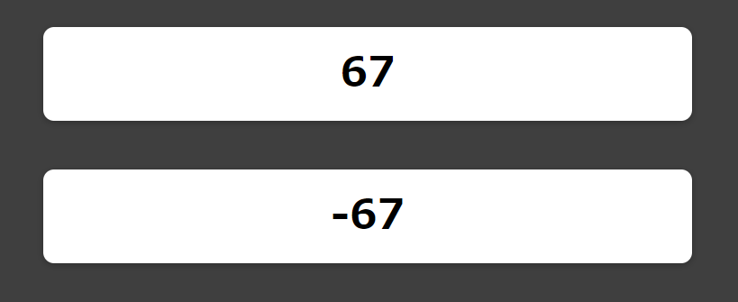

# Custom Hook 예제

## 목표

1. 커스텀 훅이란 무엇이고 왜 쓰는가?
2. 커스텀 훅은 어떻게 만들어야 하는가?
3. 커스텀 훅을 만들 때 지켜야할 규칙과 예시들

---

## 커스텀 훅이란?

커스텀 훅도 일종의 정규함수다.

대신 **state를 설정할 수 있는 로직(stateful)**을 포함한 함수다.

따라서 **재사용 가능한 함수**에 **stateful한 로직**을 아웃소싱 할 수 있다.

또한 정규함수와 다르게 커스텀 훅과 다른 리액트 훅들, 그리고 리액트 state도 사용 가능하다.

---

## 커스텀 훅 생성

우리가 받은 건 1초마다 한쪽은 카운터가 늘어나고 한쪽은 카운터가 줄어드는 app으로 `App.js`를 제외하면 3개의 컴포넌트로 이루어져 있다.

1. `Card.js` : Wrapper 컴포넌트, 스타일을 설정함.
2. `ForwardCounter.js` : useState와 useEffect를 통해 상태를 관리하고 시간간격을 만들어서, 매 1000밀리초(1초)마다 새로운 카운터 상태를 설정함
3. `BackwardCounter.js` : `ForwardCounter.js`와 비슷하지만 정반대의 로직


그런데 `BackwardCounter.js` 와 `ForwardCounter.js`는 매우 유사한 구조임 따라서 양 로직간에 중복되는 코드가 존재함.

따라서 리팩토링을 위해 함수를 뽑아내서 공통되는 코드를 갖는 함수를 만들면 된다. 그런데, 우리는 여기서 리액트의 훅을 사용하기 때문에 함수로 뽑는게 불가능하다.

왜냐하면 리액트 컴포넌트와 커스텀 훅에서만 리액트 훅을 사용 가능하기 때문이다.

컴포넌트 옆에 hooks 폴더를 만든다음 `use-counter.js` 파일을 만들어주자.

이름은 뭐든 상관없으나 **만들어진 함수는 무조건 use로 시작해야 한다.** 이는 엄격한 규칙이다.

커스텀훅은 모든 것이 반환 가능한데, 여기서 중요한 것은 숫자(시간)이므로 숫자인 `counter`를 반환하도록 하자.

_use-counter.js_
```js
import React, { useState, useEffect } from 'react';

const useCounter = () => {
    const [counter, setCounter] = useState(0);

    useEffect(() => {
        const interval = setInterval(() => {
        setCounter((prevCounter) => prevCounter + 1);
        }, 1000);

        return () => clearInterval(interval);
    }, []);

    return counter;
};

export default useCounter;
```

만약 컴포넌트 안에서 커스텀 훅을 호출하면, 커스텀 훅에서 만들어진 state가 호출한 컴포넌트에 묶이게 된다.

다수의 컴포넌트에서 커스텀 훅을 사용하면 모든 컴포넌트마다 각자의 state를 받게 되는 것이다.

따라서 **커스텀 훅을 사용한다고 해서 컴포넌트 전반에 걸쳐서 state나 effect를 공유하는 것이 아니다.**

이제 `ForwardCounter.js`를 간단하게 변경해보자.

_ForwardCounter.js_
```js
import React from 'react';

import Card from './Card';
import useCounter from '../hooks/use-counter';

const ForwardCounter = () => {

  const counter = useCounter();

  return <Card>{counter}</Card>;
};

export default ForwardCounter;

```

코드가 매우 심플해졌다.



실행도 잘된다!

## 커스텀 훅 매개변수 넣기

커스텀 훅도 함수이기 때문에 매개변수를 받을 수 있음

대신 매개변수를 넣었으면 의존성이 생기므로 의존성을 추가해줘야함. 따라서 forwards가 변경할때마다 useEffect 함수가 재실행하게 됨.

_use-counter.js_
```js
import { useState, useEffect } from 'react';

import Card from './Card';

const BackwardCounter = () => {
  const [counter, setCounter] = useState(0);

  useEffect(() => {
    const interval = setInterval(() => {
      setCounter((prevCounter) => prevCounter - 1);
    }, 1000);

    return () => clearInterval(interval);
  }, []);

  return <Card>{counter}</Card>;
};

export default BackwardCounter;
```

이제 `BackwardCounter.js`도 변경해보자

_BackwardCounter.js_
```js
import React from 'react';

import Card from './Card';
import useCounter from '../hooks/use-counter';

const BackwardCounter = () => {
  const counter = useCounter(false);

  return <Card>{counter}</Card>;
};

export default BackwardCounter;
```

