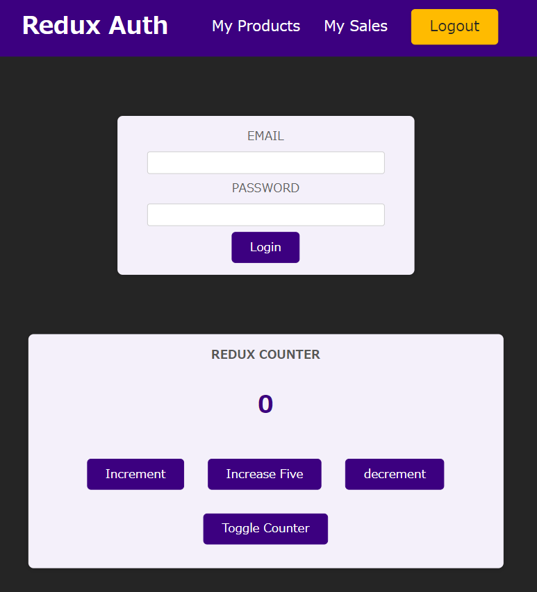

# Redux and React

리액트용 리덕스는 `npm install redux react-redux`로 설치를 해주자.

## React 전용 Redux Store

일단 store 내부에 `index.js`를 만들어 주고, 리듀서 함수를 만들어주고 그것을 store과 연결해주자.

_src/store/index.js_
```js
import { createStore } from 'redux';

const countReducer = (state = { counter: 0 }, action) => {
    if (action.type === 'increment') {
        return {
            counter: state.counter + 1
        };
    };

    if (action.type === 'decrement') {
        return {
            counter: state.counter - 1
        };
    };

    return state;
};

const store = createStore(countReducer);

export default store;
```

## Provider

우리는 store를 제공해야한다. 그러므로 Context를 썼을때와 유사하게 전체 `index.js`에 Wrapping한다.

또한 우리가 어떤 store를 제공하는지도 마찬가지로 import해준다.

_src/index.js_
```js
import React from 'react';
import ReactDOM from 'react-dom';
import { Provider } from 'react-redux';
import store from './store/index';

import './index.css';
import App from './App';

ReactDOM.render(<Provider store={store}><App /></Provider>, document.getElementById('root'));
```
---

## 컴포넌트에서 Redux 사용하기

스토어에 접근할 수 있는 `useSelector`훅과 클래스 컴포넌트를 스토어에서 연결 할 수있는 connect 훅을 불러온다.

`useSelector`가 좋은 점은 컴포넌트에 불러오면 Redux가 자동으로 Subsciption을 설정한다는 점. 

따라서 redux store가 변경하면 컴포넌트는 재실행하게 됨.

_Counter.js_

```js
import classes from './Counter.module.css';
import { useSelector, connect } from 'react-redux';

const Counter = () => {

  const counter = useSelector(state => state.counter);

  const toggleCounterHandler = () => {};

  return (
    <main className={classes.counter}>
      <h1>Redux Counter</h1>
      <div className={classes.value}>{counter}</div>
      <button onClick={toggleCounterHandler}>Toggle Counter</button>
    </main>
  );
};

export default Counter;
```

## 컴포넌트에서 Action Dispatch 하기

`useDispatch`훅을 상요하자.

```js
import classes from './Counter.module.css';
import { useSelector, useDispatch } from 'react-redux';

const Counter = () => {

  const dispatch = useDispatch();
  const counter = useSelector(state => state.counter);

  const incrementHandler = () => {
    dispatch({ type: 'increment' });
  };

  const decrementHandler = () => {
    dispatch({ type: 'decrement' });
  };

  const toggleCounterHandler = () => {};

  return (
    <main className={classes.counter}>
      <h1>Redux Counter</h1>
      <div className={classes.value}>{counter}</div>
      <div>
        <button onClick={incrementHandler}>Increment</button>
        <button onClick={decrementHandler}>decrement</button>
      </div>
      <button onClick={toggleCounterHandler}>Toggle Counter</button>
    </main>
  );
};

export default Counter;
```

---

## 페이로드

그런데 좀더 복잡한 액션, 만약에 5를 추가한다 치면, 그냥 5를 리듀서 함수에 만들어야하나? scable하지 않다!

따라서 action에 값을 추출해서 바꾸는 로직을 짜자 

_Counter.js_
```js
import classes from './Counter.module.css';
import { useSelector, useDispatch } from 'react-redux';

const Counter = () => {

  const dispatch = useDispatch();
  const counter = useSelector(state => state.counter);

  const incrementHandler = () => {
    dispatch({ type: 'increment' });
  };

  const increaseHandler = () => {
    dispatch({ type: 'increase', amount: 5 });
  };

  const decrementHandler = () => {
    dispatch({ type: 'decrement' });
  };

  const toggleCounterHandler = () => {};

  return (
    <main className={classes.counter}>
      <h1>Redux Counter</h1>
      <div className={classes.value}>{counter}</div>
      <div>
        <button onClick={incrementHandler}>Increment</button>
        <button onClick={increaseHandler}>Increase Five</button>
        <button onClick={decrementHandler}>decrement</button>
      </div>
      <button onClick={toggleCounterHandler}>Toggle Counter</button>
    </main>
  );
};

export default Counter;
```

*src/store/index.js*
```js
import { createStore } from 'redux';

const counterReducer = (state = { counter: 0 }, action) => {
  if (action.type === 'increment') {
    return {
      counter: state.counter + 1,
    };
  }

  if (action.type === 'increase') {
    return {
      counter: state.counter + action.amount,
    }
  }

  if (action.type === 'decrement') {
    return {
      counter: state.counter - 1,
    };
  }

  return state;
};

const store = createStore(counterReducer);

export default store;
```

이렇게 action에서 로직에 쓰기 위해 뽑아낸 값을 action payload라고 한다.

---

## Multi State

일단 토글 버튼에 대한 카운터가 사라지는 로직을 짜기 위해 카운터 등장 state를 만들건데, 이건 redux가 아니라 useState로 짜는게 맞다. 왜냐하면 한 곳에서만 쓸 거니까.

하지만 데모이므로 그냥 이렇게 짜자.

_store/index.js_
```js
import { createStore } from 'redux';

const initialState = { counter: 0, showCounter: true };

const counterReducer = (state = initialState, action) => {
  if (action.type === 'increment') {
    return {
      counter: state.counter + 1,
      showCounter: state.showCounter
    };
  }

  if (action.type === 'increase') {
    return {
      counter: state.counter + action.amount,
      showCounter: state.showCounter
    }
  }

  if (action.type === 'decrement') {
    return {
      counter: state.counter - 1,
      showCounter: state.showCounter
    };
  }

  if (action.type === 'toggle') {
    return {
      showCounter: !state.showCounter,
      counter: state.counter
    }
  }

  return state;
};

const store = createStore(counterReducer);

export default store;
```

_Counter.js_
```js
import classes from './Counter.module.css';
import { useSelector, useDispatch } from 'react-redux';

const Counter = () => {

  const dispatch = useDispatch();
  const counter = useSelector(state => state.counter);
  const show = useSelector(state => state.showCounter);

  const incrementHandler = () => {
    dispatch({ type: 'increment' });
  };

  const increaseHandler = () => {
    dispatch({ type: 'increase', amount: 5 });
  };

  const decrementHandler = () => {
    dispatch({ type: 'decrement' });
  };

  const toggleCounterHandler = () => {
    dispatch({ type: 'toggle' });
  }

  return (
    <main className={classes.counter}>
      <h1>Redux Counter</h1>
      {show && <div className={classes.value}>{counter}</div>}
      <div>
        <button onClick={incrementHandler}>Increment</button>
        <button onClick={increaseHandler}>Increase Five</button>
        <button onClick={decrementHandler}>decrement</button>
      </div>
      <button onClick={toggleCounterHandler}>Toggle Counter</button>
    </main>
  );
};

export default Counter;

```

이러면 자동적으로 버튼만 누르면 보였다 안보였다 한다.

## Redux State 올바르게 사용하기

Redux는 기존의 state를 대체하는데 사용하는 완전히 새로운 객체인 새 snapshot을 항상 반환해야한다.

중요한 것은 이 **반환한 state는 기존의 state와 병합하는게 아니라 덮어 쓴다는것이다.**

그러니까 만약에 이 로직에서

_store/index.js_
```js
  if (action.type === 'decrement') {
    return {
      counter: state.counter - 1,
      //showCounter: state.showCounter
    };
  }

  if (action.type === 'toggle') {
    return {
      showCounter: !state.showCounter,
      counter: state.counter
    }
  }
```
이런식으로 showCounter에 대한 것을 배제하고 로직을 짜면, 감소만 눌러도 화면이 닫혀버린다.

왜냐하면 showCounter를 설정하지 않았기 때문에 처음 값인 false를 가정하고 돌려지기 때문이다.

따라서 가장 중요한 것은 **기존의 state를 절대 변경하면 안됨.**

`Reference vs Primitive Values`와도 연관이 있으니 참고

---

## Redux Toolkit을 사용하는 이유

우리가 짠 로직에서 Redux가 관리해야할 State가 많아지면 무슨 문제가 생길까?

먼저 **type에 대한 오타문제**다. 만약 이런 프로젝트를 단체로 관리한다면? 오타를 항상 체크해야하고, IDE에서 체크를 하지도 못한다.

다음 문제는 **데이터의 크기**다. if문마다 모든 state를 다 넣어줘야하기 때문, 그럼 Redux파일이 미친듯이 커질 수 있다.

마지막은 **State의 변경 불가능성**이다. 우리는 항상 State의 스냅샷을 반환하는거지, 기존의 state는 변경할 수 없음. 게다가 중첩된 객체나 배열이 있는 복잡한 데이터는 실수로 변경이 되면서 논리가 망가질 가능성이 큼.

이러한 문제를 해결하기 위해 `Redux Toolkit`을 사용한다.

## Redux Toolkit

`npm install @reduxjs/toolkit`을 실행한 후 로직을 짜자

`createStore`대신 `createSlice`는 사용하는데 이는 객체를 인자로서 생성한다. 

여기서는 counter와 showCounter를 하나의 세트로 보고 생성을 한다.

slice는 이름이 있어야하는데 마음대로 설정이 가능하다. 이후 초기 state를 설정한다. 

이후 reducer를 설정하는데 reducer는 객체나 맵이라고 할 수 있다. 여기서는 객체로, 우리가 짰던 4개의 로직(증가, 감소, 5증가, toggle)을 전부 함수로 넣어준다.

여기서 짜는 함수의 특징은 액션을 필수로 넣어줄 필요 없다는 점이다. 왜냐하면 어떤 액션을 했느냐에 따라 메소드가 자동으로 호출이 되기 때문이다. 

또 여기서 메소드의 특징은 state를 직접 변경할 수 있다는 점이다. 즉 `state.counter++;`와 같은 것을 할 수 있다는 것이다.

하지만 그렇게 보일뿐 Redux의 state는 변경되지 않는다. 왜냐면 Redux toolkit은 내부적으로는 immer이라는 다른 패키지를 사용하는데 이런 코드를 사용하면 자동으로 감지하여 자동으로 원래 있는 상태를 복제 하기 때문이다.

그리고 increase같이 5를 증가하는 로직에서는 action을 통해 값을 추가하면 된다. action은 매개변수로 필수가 아닐 뿐이지 충분히 받아서 로직을 짤 수 있다.

또한 store에 전달하기 위해 `configureStore`을 사용하자. 여기서는 리듀서 함수가 아니라 객체를 받는데, `configureStore`에 요구되는 설정객체다.

만약 여러개의 slice가 존재한다면, reducer의 key값 대신 객체를 설정해서 그 객체 안에 내가 원하는 속성의 이름을 정하고 key값을 설정해 properties의 값들이 또다른 reducer함수가 됙 ㅔ할 수 있다.

즉 reducer map이 되는 것이고, `configureStore`이 이를 자동으로 합쳐주는 것.

여기서는 사용하지 않는다.

_store/index.js_
```js

import { createSlice, configureStore } from '@reduxjs/toolkit';

const initialState = { counter: 0, showCounter: true };

const counterSlice = createSlice({
  name: 'counter',
  initialState,
  reducers: {
    increment(state) {
      state.counter++;
    },
    decrement(state) {
      state.counter--;
    },
    increase(state, action) {
      state.counter = state.counter + action.payload;
    },
    toggleCounter(state) {
      state.showCounter = !state.showCounter;
    }
  }
})

const store = configureStore({
  reducer: counterSlice.reducer
});

export default store;
```

## toolkit으로 나머지 마이그레이션

그러면 action을 전달하려면 어떻게 해야하는가? slice의 `.actions`로 가능함. 이것도 리듀서 메서드 이름들이 key로 가능한 객체다.

redux toolkit으로 인해 자동으로 생성된 메서드가 생기고, 그 메서드가 호출되면 액션 객체가 생성된다.

따라서 이런 메서드는 액션 생성자라고 불리운다. 

_Coutner.js_
```js
import { useSelector, useDispatch } from 'react-redux';

import { counterActions } from '../store';
import classes from './Counter.module.css';


const Counter = () => {

  const dispatch = useDispatch();
  const counter = useSelector(state => state.counter);
  const show = useSelector(state => state.showCounter);

  const incrementHandler = () => {
    dispatch(counterActions.increment());
  };

  const increaseHandler = () => {
    dispatch(counterActions.increase(5));
  };

  const decrementHandler = () => {
    dispatch(counterActions.decrement());
  };

  const toggleCounterHandler = () => {
    dispatch(counterActions.toggleCounter());
  }

  return (
    <main className={classes.counter}>
      <h1>Redux Counter</h1>
      {show && <div className={classes.value}>{counter}</div>}
      <div>
        <button onClick={incrementHandler}>Increment</button>
        <button onClick={increaseHandler}>Increase Five</button>
        <button onClick={decrementHandler}>decrement</button>
      </div>
      <button onClick={toggleCounterHandler}>Toggle Counter</button>
    </main>
  );
};

export default Counter;
```

좀 더 간단하게 변환되지만, 동일하게 돌아간다! 

## Multi Slice

이번에 다양한 Slice를 만들어보자. 일단 `App.js`에 로직을 추가해주자.

```js
import { Fragment } from 'react';

import Header from './components/Header';
import Auth from './components/Auth'
import Counter from './components/Counter';

function App() {
  return (
    <Fragment>
      <Header />
      <Auth />
      <Counter />
    </Fragment>
  );
}

export default App;
```

실행하면 이렇게 된다.



여기서 로그인 관련 로직을 생각하자. 로그인을 했을 때만 Logout버튼이 나오게 만들고 싶다. 

또한 로그인 필드를 더미출력을 가지고 있는 UserProfile컴포넌트로 만들고 싶다.

이제는 새로운 State가 생겼다. 바로 사용자 인증 State

새로운 slice를 만들어서 인증상태만 관리하도록 하자.

reducers에는 login과 logout메소드를 만든다.

이제 `configureStore`을 통해 reducer 2개를 넣는 과정을 하면 된다.

`configureStore`에 reducer map을 만들어 넣어주자.

_store/index.js_
```js

import { createSlice, configureStore } from '@reduxjs/toolkit';

const initialCounterState = { counter: 0, showCounter: true };

const counterSlice = createSlice({
  name: 'counter',
  initialState: initialCounterState,
  reducers: {
    increment(state) {
      state.counter++;
    },
    decrement(state) {
      state.counter--;
    },
    increase(state, action) {
      state.counter = state.counter + action.payload;
    },
    toggleCounter(state) {
      state.showCounter = !state.showCounter;
    }
  }
});

const initialAuthState = {
  isAuthenticated: false
};

const authSlice = createSlice({
  name: 'auth',
  initialState: initialAuthState,
  reducers: {
    login(state) {
      state.isAuthenticated = true;
    },
    logout(state) {
      state.isAuthenticated = false;
    },
  },
});

const store = configureStore({
  reducer: { counter: counterSlice.reducer, auth: authSlice.reducer },
});

export const counterActions = counterSlice.actions;
export const authActions = authSlice.actions;

export default store;
```

store에 reducer map 형태로 넣었기 때문에, `Counter.js`에서 호출하는 방식도 바꿔주자.

_Counter.js_
```js
...
const Counter = () => {

  const dispatch = useDispatch();
  const counter = useSelector(state => state.counter.counter);
  const show = useSelector(state => state.counter.showCounter);
  ...
  }
...
```
---

## 새 Slice에서 읽기 및 Dispatch

먼저 수정할 것은 `App.js`다

로그인을 하냐 안하냐에 따라서 인증 혹은 유저의 정보를 띄우는 로직을 짜자. 인증 여부는 Redux를 통해 확인한다.

_App.js_
```js
import { Fragment } from 'react';
import { useSelector } from 'react-redux';

import Header from './components/Header';
import Auth from './components/Auth'
import Counter from './components/Counter';
import UserProfile from './components/UserProfile';

function App() {

  const isAuth = useSelector(state => state.auth.isAuthenticated);

  return (
    <Fragment>
      <Header />
      {!isAuth && <Auth />}
      {Auth && <UserProfile />}
      <Counter />
    </Fragment>
  );
}

export default App;
```

이제 `Header.js`에서 로그인 로그아웃 버튼에도 같은 로직을 넣자.

_Header.js_
```js
import { useSelector } from 'react-redux';

import classes from './Header.module.css';

const Header = () => {

  const isAuth = useSelector(state => state.auth.isAuthenticated);

  return (
    <header className={classes.header}>
      <h1>Redux Auth</h1>
      {isAuth && (
        <nav>
          <ul>
            <li>
              <a href='/'>My Products</a>
            </li>
            <li>
              <a href='/'>My Sales</a>
            </li>
            <li>
              <button>Logout</button>
            </li>
          </ul>
        </nav>
      )}
    </header>
  );
};

export default Header;
```

`Auth.js`에서도 로그인하는 로직을 넣어주자.

여기서는 함수를 통해 default event를 막아주고, 로그인 액션을 Dispatch해주자.

_Auth.js_
```js
import { useDispatch } from 'react-redux';

import classes from './Auth.module.css';
import { authActions } from '../store/index';

const Auth = () => {
  const dispatch = useDispatch();

  const loginHandler = (event) => {
    event.preventDefault();

    dispatch(authActions.login());
  };

  return (
    <main className={classes.auth}>
      <section>
        <form onSubmit={loginHandler}>
          <div className={classes.control}>
            <label htmlFor='email'>Email</label>
            <input type='email' id='email' />
          </div>
          <div className={classes.control}>
            <label htmlFor='password'>Password</label>
            <input type='password' id='password' />
          </div>
          <button>Login</button>
        </form>
      </section>
    </main>
  );
};

export default Auth;
```

마지막으로 `Header.js`에 로그아웃 함수를 만들어주자. 전체적인 로직은 위와 동일하다.

_Header.js_
```js
import { useSelector, useDispatch } from 'react-redux';

import classes from './Header.module.css';
import { authActions } from '../store/index';

const Header = () => {
  const dispatch = useDispatch();
  const isAuth = useSelector((state) => state.auth.isAuthenticated);

  const logoutHandler = () => {
    dispatch(authActions.logout());
  };

  return (
    <header className={classes.header}>
      <h1>Redux Auth</h1>
      {isAuth && (
        <nav>
          <ul>
            <li>
              <a href='/'>My Products</a>
            </li>
            <li>
              <a href='/'>My Sales</a>
            </li>
            <li>
              <button onClick={logoutHandler}>Logout</button>
            </li>
          </ul>
        </nav>
      )}
    </header>
  );
};

export default Header;
```
## Slice 조각내기


