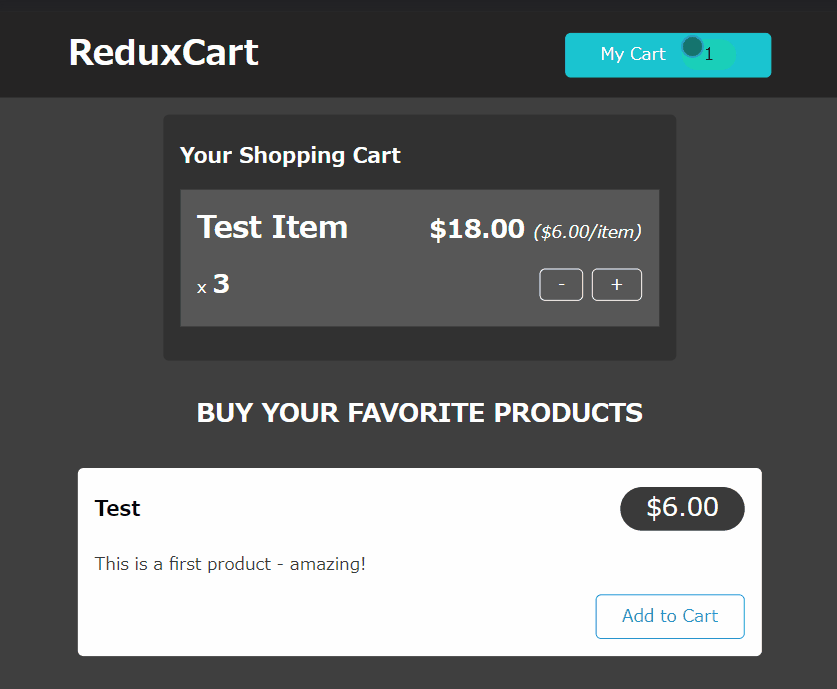
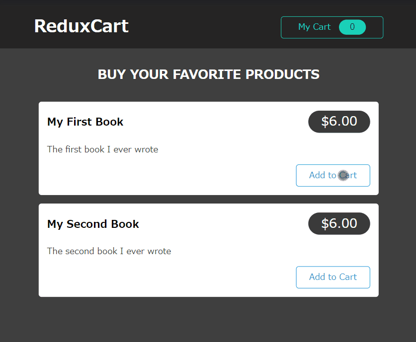
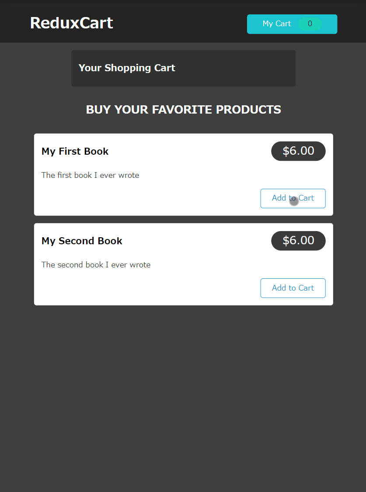
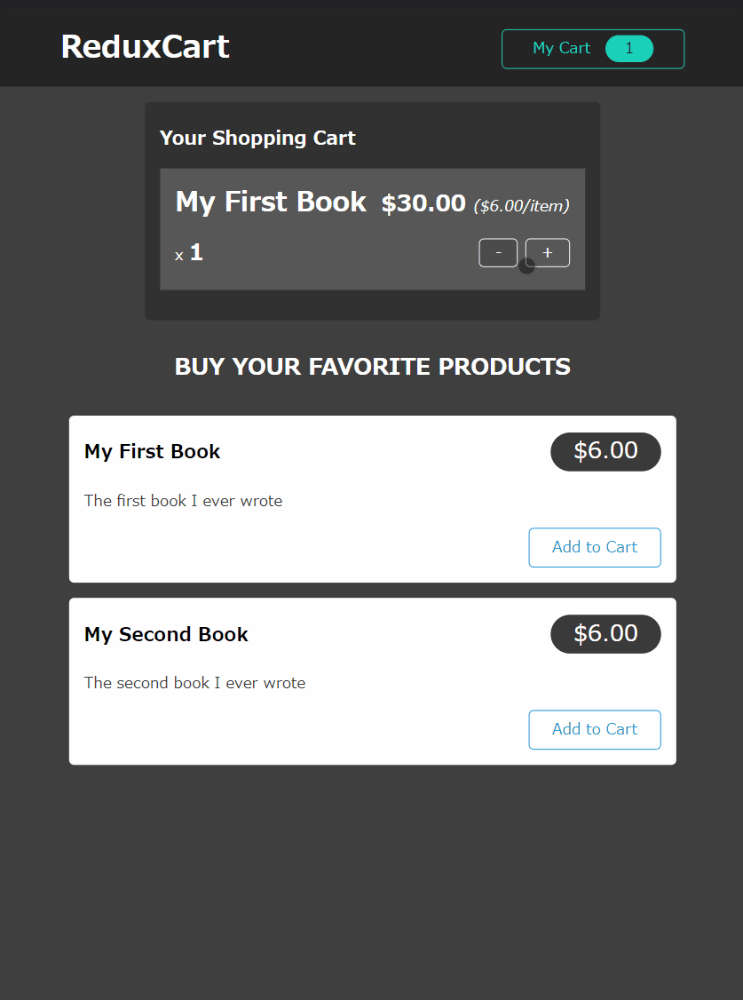

# Redux Advanced

## 목표 
1. 비동기 작업처리
2. 코드를 어디에 놔야 하는가?
3. Redux DevTools

## 사이드 이펙트, 비동기 Tasks와 Redux

### Side Effects

리듀서 함수는 **반드시 순수함수** 여야하고, **부수효과가 없고**, **동기식**이여야 한다.

이는 Redux에서 돌아가는 리듀서 함수 뿐만 아니라, `useReducer`에 전달하는 리액트 훅에서도 똑같은 방식으로 작용한다.

그러면 이러한 질문이 생긴다.

> *비동기 코드나 사이드 이펙트가 있는 코드는 어디에 작성해야 하는가?*

두가지 방법이 있다.

1. useEffect(): 컴포넌트에 직접 넣음
2. action createors function: action creators 를 간접이 아니라 직접 생성하여 side effect와 비동기를 실행.

---

## Redux 프로젝트 생성

장바구니 버튼을 클릭하면 장바구니를 보여주거나, 장바구니 버튼을 클릭하면 장바구니에 추가되거나 하는 식의 논리를 구현할거다.

store에 있는 `ui-slice.js`부터 시작하자.

여기서는 장바구니를 클릭하여 장바구니 영역을 토글하는 식의 로직을 구현할 것이다.

`createSlice`안에다 이름, 초기State, reducer키 (정확히 말하면 리듀서로 차리하고자 하는 모든 다양한 경우와 다양한 작업을 나타내는 메소드의 map)을 정한다,

_/store/cart-slice.js_
```js
import { createSlice } from '@reduxjs/toolkit';

const uiSlice = createSlice({
    name: 'ui',
    initialState: { cartIsVisible: false, },
    reducers: {
        toggle(state) {
            state.cartIsVisible = !state.cartIsVisible;
        }
    }
});

export const uiActions = uiSlice.actions;

export default uiSlice;
```

이제 이것을 `index.js`에 넣고 store에 넣어주자.

_/store/index.js_
```js
import { configureStore } from '@reduxjs/toolkit';

import uiSlice from './ui-slice';

const store = configureStore({
    reducer: { ui: uiSlice.reducer }
});

export default store;
```

이제 애플리케이션 전체에 적용을 하기 위해 root 컴포넌트를 설정하는 `index.js`에 적용을 하자

_index.js_
```js
import ReactDOM from 'react-dom';
import { Provider } from 'react-redux';

import store from './store';
import './index.css';
import App from './App';

ReactDOM.render(
<Provider store={store}>
    <App />
</Provider>, 
document.getElementById('root'));
```

이후 장바구니 버튼을 클릭하면 로직이 변해야 하므로 `CartButton.js` 컴포넌트에 dispatch 함수를 넣어주고, `uiAction`의 action을 보내도록 한다. 

_CartButton.js_
```js
import { useDispatch } from 'react-redux';

import { uiActions } from '../../store/ui-slice';
import classes from './CartButton.module.css';

const CartButton = (props) => {
  const dispatch = useDispatch();

  const toggleCartHandler = () => {
    dispatch(uiActions.toggle());
  };

  return (
    <button className={classes.button} onClick={toggleCartHandler}>
      <span>My Cart</span>
      <span className={classes.badge}>1</span>
    </button>
  );
};

export default CartButton;

```

여기서 얻을 수 있는 자동 생성 action은 실제로 실행해야하는 action creator 메소드 이기 때문에, 여기서는 토글을 메소드로 실행해야한다.

그러면 action객체를 반환하게 된다. 그리고 반환한 action 객체가 `toggleCartHandler`내부의 dispatch에서 dispatch 되는 것이다.

그리고 우리는 버튼을 클릭할때마다 `toggleCartHandler`를 트리거 해야하는데, 그러기 위해서는 uiSlice의 state를 조건부로 렌더링 해야하므로 `App.js`로 가서 앱 컴포넌트 내부에서 리덕스의 데이터를 추출하는 로직을 짜자. 

`useSelector`를 사용하는데 이걸 사용하려면 redux state를 자동으로 받는 함수를 전달해야한다.

따라서 현재 state를 자동으로 수신한 다음 이 컴포넌트에서 사용하려는 데이터를 반환해야한다. 그것은 `cartIsVisible`이므로, state의 해당 부분으로 dril하기 위해서 `state.ui.cartIsVisible`을 사용하자.

이제 클릭하고 작동하는 로직은 적용된다.



이제 장바구니 추가를 클릭하거나 +를 클릭하면 장바구니 항목이 업데이트 되는 로직을 짜보자.

여기에서도 value의 batch가 `CartButton.js`에서도 업데이트 되어야 한다.

일단 리듀서 함수부터 짜자.

_cart-slice.js_
```js
import { createSlice } from "@reduxjs/toolkit";

const cartSlice = createSlice({
    name: 'cart',
    initialState: {
        items: [],
        totalQuantity: 0,
        totalAmount: 0
    },
    reducers: {
        addItemFromCart(state, action) {
            const newItem = action.payload;
            const existingItem = state.items.find((item) => item.id === newItem.id);
            state.totalQuantity++;
            if (!existingItem) {
                state.items.push({
                    itemId: newItem.id, 
                    price: newItem.price, 
                    quantiy: 1, 
                    totalPrice: newItem.price
                });
            } else {
                existingItem.quantiy++;
                existingItem.totalPrice = existingItem.totalPrice + newItem.price;
            }
        },
        removeItemFromCart(state, action) {
            const id = action.payload;
            const existingItem = state.items.find(item => item.id === id);
            state.totalQuantity--;
            if (existingItem.quantiy === 1) {
                state.items = state.items.filter(item => item.id !== id);
            } else {
                existingItem.quantiy--;
            }
        },
    }
});

export const cartActions = cartSlice.actions;

export default cartSlice;
```
이후 `index.js`의 store에 reducer 함수를 넣자.

_store/index.js_
```js
import { configureStore } from '@reduxjs/toolkit';

import uiSlice from './ui-slice';
import cartSlice from './cart-slice';

const store = configureStore({
    reducer: { ui: uiSlice.reducer, cart: cartSlice.reducer }
});

export default store;
```


이제 `Products.js`에서 하드코딩된 부분을 바꾸자. 우리가 작업하는 데이터를 가질 수 있도록 동적으로 생성되게!

```js
import ProductItem from './ProductItem';
import classes from './Products.module.css';

const DUMMY_PRODUCTS = [
  {
    id: 'p1',
    price: 6,
    title: 'My First Book',
    description: 'The first book I ever wrote',
  }, 
  {
    id: 'p2',
    price: 6,
    title: 'My Second Book',
    description: 'The second book I ever wrote',
  }
];

const Products = (props) => {
  return (
    <section className={classes.products}>
      <h2>Buy your favorite products</h2>
      <ul>
        {DUMMY_PRODUCTS.map((product) => (
        <ProductItem
          key={product.key}
          title={product.id}
          price={product.price}
          description={product.description}
        />
        ))}
        
      </ul>
    </section>
  );
};

export default Products;

```
이후 `ProductItem.js`  에서의 `addToCart`함수를 통해 이것을 장바구니에 입력하는 함수와 연결지어보자.

_ProductItem.js_
```js
import { useDispatch } from 'react-redux';

import { cartActions } from '../../store/cart-slice';
import Card from '../UI/Card';
import classes from './ProductItem.module.css';

const ProductItem = (props) => {
  const dispatch = useDispatch();

  const { title, price, description, id } = props;

  const addToCartHandler = () => {
    dispatch(cartActions.addItemFromCart({
      id,
      title,
      price,
      })
    );
  };

  return (
    <li className={classes.item}>
      <Card>
        <header>
          <h3>{title}</h3>
          <div className={classes.price}>${price.toFixed(2)}</div>
        </header>
        <p>{description}</p>
        <div className={classes.actions}>
          <button onClick={addToCartHandler}>Add to Cart</button>
        </div>
      </Card>
    </li>
  );
};

export default ProductItem;
```

이제 batch를 통해 Cart에 표시를 해보자. 즉 Cart의 데이터를 옯겨보자. `CartButton.js`으로 가자.

useSelector을 통해 Redux에 있는 데이터(state)를 불러오고 표시하자. 여기서는 전체 수량이 중요하므로 전체수량.

_CartButton.js_
```js
import { useDispatch, useSelector } from 'react-redux';

import { uiActions } from '../../store/ui-slice';
import classes from './CartButton.module.css';

const CartButton = (props) => {
  const dispatch = useDispatch();
  // cartQuantity 추가
  const cartQuantity = useSelector((state) => state.cart.totalQuantity);

  const toggleCartHandler = () => {
    dispatch(uiActions.toggle());
  };

  // cartQuantity 추가
  return (
    <button className={classes.button} onClick={toggleCartHandler}>
      <span>My Cart</span>
      <span className={classes.badge}>{cartQuantity}</span>
    </button>
  );
};

export default CartButton;
```

이제 실행해보면?



Cart Button의 갯수가 계속 올라간다.

이제 `Cart.js`에서 실제로 cart에 올라간 제품이 올라가도록 로직을 짜자.

_Cart.js_
```js
import { useSelector } from 'react-redux';

import Card from '../UI/Card';
import classes from './Cart.module.css';
import CartItem from './CartItem';

const Cart = (props) => {

  const cartItems = useSelector((state) => state.cart.items);

  return (
    <Card className={classes.cart}>
      <h2>Your Shopping Cart</h2>
      <ul>
        {cartItems.map((item) => (
          <CartItem
          key={item.id}
          item={{ 
            id: item.id
            title: item.title,
            quantity: item.quantity,
            total: item.totalPrice,
            price: item.price,
          }}
        />
        ))}
        
      </ul>
    </Card>
  );
};

export default Cart;
```



정상적으로 작동한다. 이제 플러스 마이너스 기호를 써서 삭제하는 로직을 짜자.

`CartItem.js`로 가서, dispatch를 통해 증가 메소드, 감소 메소드를 구현하자.

중요한건 `cart-slice.js`에서 삭제 로직의 `action.payload`는 `id`이므로 `id`기준으로 로직을 짜야한다. 

_CartItem.js_
```js
import { useDispatch } from 'react-redux';
import { cartActions } from '../../store/cart-slice';
import classes from './CartItem.module.css';

const CartItem = (props) => {
  const dispatch = useDispatch();
  const { title, quantity, total, price, id } = props.item;

  const removeItemHandler = () => {
    dispatch(cartActions.removeItemFromCart(id));
  };

  const addItemHandler = () => {
    dispatch(cartActions.addItemFromCart({
      id,
      title,
      price,
    }))
  }

  return (
    <li className={classes.item}>
      <header>
        <h3>{title}</h3>
        <div className={classes.price}>
          ${total.toFixed(2)}{' '}
          <span className={classes.itemprice}>(${price.toFixed(2)}/item)</span>
        </div>
      </header>
      <div className={classes.details}>
        <div className={classes.quantity}>
          x <span>{quantity}</span>
        </div>
        <div className={classes.actions}>
          <button onClick={removeItemHandler}>-</button>
          <button onClick={addItemHandler}>+</button>
        </div>
      </div>
    </li>
  );
};

export default CartItem;
```
이제 제대로 작동하는지 확인해보자



제대로 작동한다.

---

## Redux and Async

우리는 앞서 말했듯이, 리덕스의 개념에 따라서, 리듀서 내부에 http request를 보낼 수 없다.

따라서 우리는 state의 업데이트를 완료한 후 http요청을 보내도록 한다. 

## 잘못된 구현.

`ProductItem.js`에서 useSelector을 통해 `cart`를 가져온 다음, `addToCartHandler`를 통해 새로운 총 수량을 생성한다. 여기서는 새 state를 만들지 않는 것이 중요.

왜냐하면 redux toolkit과 다르게 그러한 로직이 자동으로 적용되지 않기 때문.

따라서 `addToCartHandler`에서 새로운 데이터를 추가하는 로직을, 구현하는 방식으로 되는 것.

그런데 이 방식의 문제는 애플리케이션의 모든 부분에서 이 로직을 사용한다면 이 컴포넌트에 추가한 모든 논리를 Cart항목의 컴포넌트에 복사해야한다. 

문제 또 하나는 리듀서에서 변환을 수행하지 않는 것. 그렇다면 Redux를 쓸 이유가 없다!

우리는 fat Reducer, fat Component, fat Action 중에 선택해야한다. 이 것을 고려할때는 사이드이펙트 / 비동기가 고려 대상이 되야 한다. 

## useEffect 컴포넌트 구현

순서를 전환하여 사용한다. 프론트엔드에서 작업을 수행한 다음, 리덕스가 스토어를 업데이트 하는 방식.

`App.js`를 예를 들어보자. 여기서는 `useSelector`안에 있는 state가 변할때마다, 즉 cart가 변할때마다 http 요청을 보낼 수 있다.

우리는 `useEffect`를 사용해서 사이드 이펙트를 실행할 수 있는것을 안다.

따라서 종속성이 변경될때마다 실행할 수 있다. 이제 로직을 짜자.

useEffect안에 fetch API를 불러와서 http 요청을 보내자. 여기서는 PUT요청을 보내는데 왜냐하면 데이터를 목록에 추가하지 않고 오버라이드 하기 때문에, Cart를 수신데이터로 오버라이드 하는 로직이 완성되기 때문이다.


_App.js_
```js
import { useEffect } from 'react';
import { useSelector } from 'react-redux';

import Cart from './components/Cart/Cart';
import Layout from './components/Layout/Layout';
import Products from './components/Shop/Products';

const URL = 'https://react-http-bc15f-default-rtdb.firebaseio.com/cart.json';

function App() {

  const showCart = useSelector((state) => state.ui.cartIsVisible);
  const cart = useSelector((state) => state.cart);

  useEffect(() => {
    fetch(URL, { 
      method: 'PUT', 
      body: JSON.stringify(cart) 
    });
  }, [cart]);
  return (
    <Layout>
      {showCart && <Cart />}
      <Products />
    </Layout>
  );
}

export default App;
```

이렇게 로직을 짜면, `useSelector`가 Subscribe를 한다는 점이다. 즉 리덕스 스토어가 변경될 때마다 컴포넌트 함수가 다시 실행되고 최신 state가 된다는 것이다.

따라서 effect도 재평가 되고 Cart가 변경되면 다시 실행 되므로 우리가 원하는 순서인 것이다.

따라서 우리는 간단한 컴포넌트의 로직을 사용하여 fat한 리듀서를 만든 다음, 리덕스 state에 따라 달라지는 side effect를 수행할 수 있게 된다.

다만 useEffect에도 문제가 있는데 만든 리액트 프론트애플리케이션을 재실행할 때마다 firebase의 백엔드가 초기화 된다.

왜냐하면 실행되자마자 useEffect는 시작이 되므로 우리는 항상 비어있는 카트를 백엔드에 보내고 거기에 저장된 모든 데이터를 덮어쓴게 된다.

---

## 리덕스로 Http State 및 피드백 처리하기

상단에 작은 막대기로 http 요청/반응 성공 실패를 알려주는 컴포넌트를 만들었다 (첨부함.)

이걸 useEffect에 적용시켜보자. 그럴려면 useEffect 안에 async/await를 적용시키면 된다. 

이전에, ui-slice에 이것이 에러인지 아닌지에 관한 state를 적용시키자 

_ui-slice.js_
```js
import { createSlice } from '@reduxjs/toolkit';

const uiSlice = createSlice({
  name: 'ui',
  initialState: { cartIsVisible: false, notification: null },
  reducers: {
    toggle(state) {
      state.cartIsVisible = !state.cartIsVisible;
    },
    showNotification(state, action) {
      state.notification = {
        status: action.payload.status,
        title: action.payload.title,
        message: action.payload.message,
      };
    },
  },
});

export const uiActions = uiSlice.actions;

export default uiSlice;
```

dispatch를 통해 `App.js`의 `useEffect` 내부에 `response`의 값에 따라 state의 값을 변하게 해주는 로직을 짜준다. 

이제 `Notification.js`를 불러와서 Http 통신을 확인하는 막대기를 구현하자.

그리고 처음 제기했던 문제인, 처음 실행하자 마자 useEffect가 실행되며 빈 장바구니를 보내던 로직을 고쳐보자.

함수 외부에 변수를 구현하여 컴포넌트가 재구현되도 초기화 되지 않게 하자. 이후 변수 `isInitial`의 Boolean값에 따라 바로 return되게 하고, Boolean을 바꾸도록 짜자. 

_App.js_
```js
import { Fragment, useEffect } from 'react';
import { useSelector, useDispatch } from 'react-redux';

import Cart from './components/Cart/Cart';
import Layout from './components/Layout/Layout';
import Products from './components/Shop/Products';
import { uiActions } from './store/ui-slice';
import Notification from './components/UI/Notification';

let isInitial = true;

function App() {
  const dispatch = useDispatch();
  const showCart = useSelector((state) => state.ui.cartIsVisible);
  const cart = useSelector((state) => state.cart);
  const notification = useSelector((state) => state.ui.notification);

  const URL = 'https://react-http-bc15f-default-rtdb.firebaseio.com/cart.json';

  useEffect(() => {
    const sendCartData = async () => {
      dispatch(
        uiActions.showNotification({
          status: 'pending',
          title: 'Sending...',
          message: 'Sending cart data!',
        })
      );
      const response = await fetch(
        URL ,
        {
          method: 'PUT',
          body: JSON.stringify(cart),
        }
      );

      if (!response.ok) {
        throw new Error('Sending cart data failed.');
      }

      dispatch(
        uiActions.showNotification({
          status: 'success',
          title: 'Success!',
          message: 'Sent cart data successfully!',
        })
      );
    };

    if (isInitial) {
      isInitial = false;
      return;
    }

    sendCartData().catch((error) => {
      dispatch(
        uiActions.showNotification({
          status: 'error',
          title: 'Error!',
          message: 'Sending cart data failed!',
        })
      );
    });
  }, [cart, dispatch]);

  return (
    <Fragment>
      {notification && (
        <Notification
          status={notification.status}
          title={notification.title}
          message={notification.message}
        />
      )}
      <Layout>
        {showCart && <Cart />}
        <Products />
      </Layout>
    </Fragment>
  );
}

export default App;
```
하지만 이렇게 해도 Firebase의 데이터를 사용하는 것은 아니기 때문에 장바구니는 빈 상태에서 시작된다.

다만 firebase의 백엔드에는 제대로 저장된다.

## Action Creator Thunk

우린 Action Creator를 사용하여, useEffect에 구현된 사이드 이펙트 로직을 다 옮겨보자,

이것을 `Thunk`라고 한다. 

`Thunk`는 **다른 작업이 완료될 때 까지 작업을 지연시키는 단순한 함수**다.

대신에 **Action을 반환하는 다른 함수를 반환한다**

`Thunk`는 Slice와 동일한 파일에 작성해야한다. 

리덕스 툴킷은 모든 리듀서 메소드에 대해 Action Creator를 자동으로 생성하기 때문에 리듀서 함수의 이름을 사용하여 호출되는 Action Creator를 수신한다.

따라서 `Thunk`에서는 객체를 반환하는게 아니라 함수를 반환한다.

고로 인수는 Dispatch 함수가 된다.

`Thunk`의 장점은 독립적인 JS 함수이기 때문에, 비동기/사이드 이펙트의 구현이 가능하다는 점이다. 따라서 반환하는 함수를 async를 써서 구현이 가능하다. 

_cart-slice.js_
```js
import { createSlice } from '@reduxjs/toolkit';

import { uiActions } from './ui-slice';

const cartSlice = createSlice({
  name: 'cart',
  initialState: {
    items: [],
    totalQuantity: 0,
  },
  reducers: {
    replaceCart(state, action) {
      state.totalQuantity = action.payload.totalQuantity;
      state.items = action.payload.items;
    },
    addItemToCart(state, action) {
      const newItem = action.payload;
      const existingItem = state.items.find((item) => item.id === newItem.id);
      state.totalQuantity++;
      if (!existingItem) {
        state.items.push({
          id: newItem.id,
          price: newItem.price,
          quantity: 1,
          totalPrice: newItem.price,
          title: newItem.title,
        });
      } else {
        existingItem.quantity++;
        existingItem.totalPrice = existingItem.totalPrice + newItem.price;
      }
    },
    removeItemFromCart(state, action) {
      const id = action.payload;
      const existingItem = state.items.find((item) => item.id === id);
      state.totalQuantity--;
      if (existingItem.quantity === 1) {
        state.items = state.items.filter((item) => item.id !== id);
      } else {
        existingItem.quantity--;
      }
    },
  },
});

export const sendCartData = (cart) => {

    const URL = 'https://react-http-bc15f-default-rtdb.firebaseio.com/cart.json';
  return async (dispatch) => {
    dispatch(
      uiActions.showNotification({
        status: 'pending',
        title: 'Sending...',
        message: 'Sending cart data!',
      })
    );

    const sendRequest = async () => {
      const response = await fetch(
        URL,
        {
          method: 'PUT',
          body: JSON.stringify(cart),
        }
      );

      if (!response.ok) {
        throw new Error('Sending cart data failed.');
      }
    };

    try {
      await sendRequest();

      dispatch(
        uiActions.showNotification({
          status: 'success',
          title: 'Success!',
          message: 'Sent cart data successfully!',
        })
      );
    } catch (error) {
      dispatch(
        uiActions.showNotification({
          status: 'error',
          title: 'Error!',
          message: 'Sending cart data failed!',
        })
      );
    }
  };
};

export const cartActions = cartSlice.actions;

export default cartSlice;
```

이후 이에 맞게 `App.js`를 구축한다. 

```js
import { Fragment, useEffect } from 'react';
import { useSelector, useDispatch } from 'react-redux';

import Cart from './components/Cart/Cart';
import Layout from './components/Layout/Layout';
import Products from './components/Shop/Products';
import Notification from './components/UI/Notification';
import { sendCartData } from './store/cart-slice';

let isInitial = true;

function App() {
  const dispatch = useDispatch();
  const showCart = useSelector((state) => state.ui.cartIsVisible);
  const cart = useSelector((state) => state.cart);
  const notification = useSelector((state) => state.ui.notification);

  

  useEffect(() => {
    if (isInitial) {
      isInitial = false;
      return;
    }
    dispatch(sendCartData(cart));

  }, [cart, dispatch]);

  return (
    <Fragment>
      {notification && (
        <Notification
          status={notification.status}
          title={notification.title}
          message={notification.message}
        />
      )}
      <Layout>
        {showCart && <Cart />}
        <Products />
      </Layout>
    </Fragment>
  );
}

export default App;
```

이렇게 되면 우리는 컴포넌트를 lean한 상태로 유지할 수 있고 리듀서함수를 fat하게 만든 것이다. 

Http 통신을 신경쓰지 않고 힘든 작업을 전부 redux파일에 모두 보내버린 것.

---

## 데이터 가져오기 시작

먼저 `Thunk`가 너무 커지므로, `cart-action.js`로 따로 분리하자.

이 후 데이터를 가져오는 `fetchCartData`함수를 구현한다.

```js
import { uiActions } from "./ui-slice";
import { cartActions } from "./cart-slice";

const URL = 'https://react-http-bc15f-default-rtdb.firebaseio.com/cart.json';

export const fetchCartData = () => {
    return async (dispatch) => {
        const fetchData = async () => {
            const response = await fetch(URL);
            if(!response.ok) {
                throw new Error('Could not fetch cart data!');
            }

            const data = await response.json();

            return data;
        };

        try {
            const cartData = await fetchData();
            dispatch(cartActions.replaceCart(cartData));
        } catch(error) {
            dispatch(
                uiActions.showNotification({
                    status: 'error',
                    title: 'Error!',
                    message: 'Sending cart data failed!',
                })
            );
        }
    };
};

export const sendCartData = (cart) => {

    
  return async (dispatch) => {
    dispatch(
      uiActions.showNotification({
        status: 'pending',
        title: 'Sending...',
        message: 'Sending cart data!',
      })
    );

    const sendRequest = async () => {
      const response = await fetch(
        URL,
        {
          method: 'PUT',
          body: JSON.stringify(cart),
        }
      );

      if (!response.ok) {
        throw new Error('Sending cart data failed.');
      }
    };

    try {
      await sendRequest();

      dispatch(
        uiActions.showNotification({
          status: 'success',
          title: 'Success!',
          message: 'Sent cart data successfully!',
        })
      );
    } catch (error) {
      dispatch(
        uiActions.showNotification({
          status: 'error',
          title: 'Error!',
          message: 'Sending cart data failed!',
        })
      );
    }
  };
};

```

이제 `App.js`에도 useEffect를 써서 이 함수를 구현한다.

_App.js_
```js
import { Fragment, useEffect } from 'react';
import { useSelector, useDispatch } from 'react-redux';

import Cart from './components/Cart/Cart';
import Layout from './components/Layout/Layout';
import Products from './components/Shop/Products';
import Notification from './components/UI/Notification';
import { sendCartData, fetchCartData } from './store/cart-action';

let isInitial = true;

function App() {
  const dispatch = useDispatch();
  const showCart = useSelector((state) => state.ui.cartIsVisible);
  const cart = useSelector((state) => state.cart);
  const notification = useSelector((state) => state.ui.notification);

  useEffect(() => {
    dispatch(fetchCartData())
  }, [dispatch])

  useEffect(() => {
    if (isInitial) {
      isInitial = false;
      return;
    }
    dispatch(sendCartData(cart));

  }, [cart, dispatch]);

  return (
    <Fragment>
      {notification && (
        <Notification
          status={notification.status}
          title={notification.title}
          message={notification.message}
        />
      )}
      <Layout>
        {showCart && <Cart />}
        <Products />
      </Layout>
    </Fragment>
  );
}

export default App;
```

이렇게 되면 생기는 오류는, 새로고침할때마다 장바구니를 자동으로 다시 보내는 오류가 있음. 

먼저 `cart-slice.js`에 이동해서, 초기 상태의 property를 만들고 false로 바꾸어 설정하자.

_cart-slice.js_
```js
import { createSlice } from '@reduxjs/toolkit';

const cartSlice = createSlice({
  name: 'cart',
  initialState: {
    items: [],
    totalQuantity: 0,
    changed: false,
  },
  reducers: {
    replaceCart(state, action) {
      state.totalQuantity = action.payload.totalQuantity;
      state.items = action.payload.items;
    },
    addItemToCart(state, action) {
      const newItem = action.payload;
      const existingItem = state.items.find((item) => item.id === newItem.id);
      state.totalQuantity++;
      state.changed = true;
      if (!existingItem) {
        state.items.push({
          id: newItem.id,
          price: newItem.price,
          quantity: 1,
          totalPrice: newItem.price,
          title: newItem.title,
        });
      } else {
        existingItem.quantity++;
        existingItem.totalPrice = existingItem.totalPrice + newItem.price;
      }
    },
    removeItemFromCart(state, action) {
      const id = action.payload;
      const existingItem = state.items.find((item) => item.id === id);
      state.totalQuantity--;
      state.changed = true;
      if (existingItem.quantity === 1) {
        state.items = state.items.filter((item) => item.id !== id);
      } else {
        existingItem.quantity--;
        existingItem.totalPrice = existingItem.totalPrice - existingItem.price;
      }
    },
  },
});


export const cartActions = cartSlice.actions;

export default cartSlice;
```

이후 `App.js`에서도 로직을 알맞게 짜주자.

_App.js_
```js
import { Fragment, useEffect } from 'react';
import { useSelector, useDispatch } from 'react-redux';

import Cart from './components/Cart/Cart';
import Layout from './components/Layout/Layout';
import Products from './components/Shop/Products';
import Notification from './components/UI/Notification';
import { sendCartData, fetchCartData } from './store/cart-action';

let isInitial = true;

function App() {
  const dispatch = useDispatch();
  const showCart = useSelector((state) => state.ui.cartIsVisible);
  const cart = useSelector((state) => state.cart);
  const notification = useSelector((state) => state.ui.notification);

  useEffect(() => {
    dispatch(fetchCartData())
  }, [dispatch]);

  useEffect(() => {
    if (isInitial) {
      isInitial = false;
      return;
    }

    if (cart.changed) {
      dispatch(sendCartData(cart));
    }

    
  }, [cart, dispatch]);

  return (
    <Fragment>
      {notification && (
        <Notification
          status={notification.status}
          title={notification.title}
          message={notification.message}
        />
      )}
      <Layout>
        {showCart && <Cart />}
        <Products />
      </Layout>
    </Fragment>
  );
}

export default App;
```
다음에는 마이너스로 0가 되면, 키가 없어서 생기는 오류를 해결하자.

cart대신 객체를 넣어서, `items`가 없으면 빈 객체를 내놓게 만들자.

_cart-slice.js_
```js
import { uiActions } from "./ui-slice";
import { cartActions } from "./cart-slice";

const URL = 'https://react-http-bc15f-default-rtdb.firebaseio.com/cart.json';

export const fetchCartData = () => {
    return async (dispatch) => {
        const fetchData = async () => {
            const response = await fetch(URL);

            if(!response.ok) {
                throw new Error('Could not fetch cart data!');
            }

            const data = await response.json();

            return data;
        };

        try {
            const cartData = await fetchData();
            dispatch(
                cartActions.replaceCart({
                    items: cartData.items || [],
                    totalQuantity: cartData.totalQuantity,
            }));
        } catch(error) {
            dispatch(
                uiActions.showNotification({
                    status: 'error',
                    title: 'Error!',
                    message: 'Sending cart data failed!',
                })
            );
        }
    };
};
...
```
---

## Redux Devtools

[Redux DevTools](https://chrome.google.com/webstore/detail/redux-devtools/lmhkpmbekcpmknklioeibfkpmmfibljd?hl=ko)


