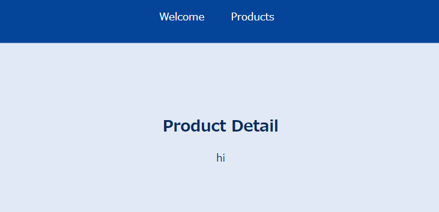
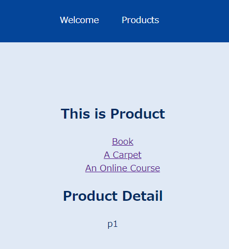
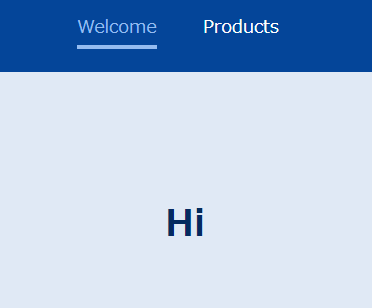
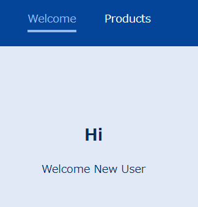

# Routing

지금까지 만든 리액트 프로젝트에는 공통점이 하나 있는데 바로 기본적으로 한 파에지를 기반으로 하며 URL이 절대 바뀌지 않는 다는 점이다.

그러나 이것은 이상적이지 않을 수 있는데, 웹 애플리케이션의 장점 중 하나는 특정 페이지나 웹 사이트 내부의 기능에 직접 연결 할 수 있는 것이기 때문이다.

따라서 이번에는 `Routing`, Single-Page Application Routing 이라는 개념을 배울것이다.

따라서 우리는 리액트와 브라우저가 사용자에게 표시되는 업데이트를 담당하는 SPA를 계속 구축하면서도 URL을 변경할 수 있고 여러 페이지를 사용할 수 있다.

## 목표

1. Client-Side Routing이란 무엇인가
2. React-Router 사용하기
3. Dinamic & Nested Routes

## Routing이란?

원래 URL이 바뀐다면 그에 맞게 시각적 컨텐츠도 바뀌는 것이 웹이 돌아가는 방식이다.

원래는 이것을 다중으로 HTML파일을 통해 저장하거나 해당 파일을 서버에서 동적으로 생성하여 구축했다.

따라서 page가 전환되면 새로운 Requests와 Response가 필요했다.

그러나 우리는 이런 흐름이 아니라 클라이언트 측 애플리케이션을 로드하기 위해 JS웹앱이 필요하다. 이 애플리케이션을 통해, JS로 화면에 표시되는 내용을 변경하고자 한다.

왜? 브라우저에서 할 수 있는 즉각적인 반응형 사용자 경험을 제공하기 위해서.

이제는 구조가 다르다. 우리는 URL에 따라 JS가 그에 맞는 컨텐츠를 제공하지만 HTML을 제공하지는 않는다. 단 하나의 HTML만 항상 존재하는 것이다.

---

## 라우터 

_App.js_
```js
import { Route } from 'react-router-dom';
import Products from './pages/Products';
import Welcome from './pages/Welcome';

function App() {
  return (
    <div>
      <Route path="/welcome">
        <Welcome />
      </Route>
      <Route path="/products">
        <Products />
      </Route>
    </div>
  );
}

export default App;

//domain.com/welcome => Welcome
//domain.com/products => Products
```
_index.js_
```js
import ReactDOM from 'react-dom';

import './index.css';
import App from './App';
import { BrowserRouter } from 'react-router-dom';

ReactDOM.render(<BrowserRouter><App /></BrowserRouter>, document.getElementById('root'));
```

이렇게만하면 구성이 됨!


## 링크 작업

메인헤더에 우리가 만든 컴포넌트의 링크를 넣는다고 생각해보자.

_MainHeader.js_

```js
const MainHeader = () => {
    return <header>
        <nav>
            <ul>
                <li>
                    <a href='/welcome'>Welcome</a>
                </li>
                <li>
                    <a href='products'>Products</a>
                </li>
            </ul>
        </nav>
    </header>;
}

export default MainHeader;
```

_App.js_
```js
import { Route } from 'react-router-dom';
import MainHeader from './components/MainHeader';
import Products from './pages/Products';
import Welcome from './pages/Welcome';

function App() {
  return (
    <div>
      <MainHeader />
      <Route path="/welcome">
        <Welcome />
      </Route>
      <Route path="/products">
        <Products />
      </Route>
    </div>
  );
}

export default App;
```

그러나 이렇게 짜게 된다면 링크를 클릭할때마다 HTML파일이 로드되게 됨.

즉 서버에 요청을 보낸 다는 뜻. 이것은 우리가 원하는 SPA개념과 다름. 새로고침할때마다 state를 잃을 수도 있음.

따라서 이렇게 바꾸자. 

```js
import { NavLink } from "react-router-dom";

import classes from './MainHeader.module.css';

const MainHeader = () => {
  return (
    <header className={classes.header}>
      <nav>
        <ul>
          <li>
            <NavLink activeClassName={classes.active} to='/welcome'>Welcome</NavLink>
          </li>
          <li>
            <NavLink activeClassName={classes.active} to='products'>Products</NavLink>
          </li>
        </ul>
      </nav>
    </header>
  );
};

export default MainHeader;
```

`NavLink`를 라우터에서 가져와서 쓰게 되면, 브라우저 기본값을 유지하는 대신 URL을 수동으로 업데이트 한다.

또한 `activeClassName`을 통해 css도 사용할 수 있다.

---

## 동적경로

Product의 세부사항을 알고싶다 했을때. 어떻게 해야하나?

_ProductDetail.js_
```js
const ProductDetail = () => {
  return ( 
    <section>
      <h1>Product Detail</h1>
    </section>
  );
};

export default ProductDetail;
```

이후 `App.js`에 가서 경로를 추가하는데, product당 이름이 다를 수 있으므로 동적경로로 설정해준다.

_App.js_
```js
import { Route } from 'react-router-dom';
import MainHeader from './components/MainHeader';
import ProductDetail from './components/ProductDetail';
import Products from './pages/Products';
import Welcome from './pages/Welcome';

function App() {
  return (
    <div>
      <MainHeader />
      <main>
        <Route path="/welcome">
          <Welcome />
        </Route>
        <Route path="/products">
          <Products />
        </Route>
        <Route path='/product-detail/:productId'>
          <ProductDetail />
        </Route>
      </main>
    </div>
  );
}

export default App;
```

이렇게 되면 _url/product-detail/1_ 이런식으로 해도 `ProductDetail`로 이동한다..

## 경로 매개변수 추출

`useParams`를 사용한다.

_ProductDetail.js_
```js
import { useParams } from "react-router-dom";

const ProductDetail = () => {

  const params = useParams();

  return ( 
    <section>
      <h1>Product Detail</h1>
      <p>{params.productId}</p>
    </section>
  );
};

export default ProductDetail;
```

`url/product-detail/hi`의 결과



## Switch, exact

제품 상세 정보 페이지로 바로 이동되지 않고, 수동으로 url을 입력해줘야 하는 문제가 있음.

따라서 Link를 통해 설정해주자

_Products.js_
```js
import { Link } from "react-router-dom";

const Products = () => {
  return (
    <section>
      <h1>This is Product</h1>
      <ul>
        <li>
          <Link to='/products/p1'>Book</Link>
        </li>
        <li>
          <Link to='/products/p2'>A Carpet</Link>
        </li>
        <li>
          <Link to='/products/p3'>An Online Course</Link>
        </li>
      </ul>
    </section>
  );
};
export default Products;
```

`App.js`도 url설정을 맞추기 위해 약간 변경을 하자.


_App.js_
```js
...
function App() {
  return (
    <div>
      <MainHeader />
      <main>
        <Route path="/welcome">
          <Welcome />
        </Route>
        <Route path="/products">
          <Products />
        </Route>
        <Route path='/products/:productId'>
          <ProductDetail />
        </Route>
      </main>
    </div>
  );
}

export default App;
```

이러면 문제가, 여러개가 한번에 로드 됨...



따라서 이걸 막기 위해 Switch 컴포넌트를 사용하자.

이후 products에는 정확히 일치할때만 표시하는 exact를 표시한다.

_App.js_
```js
import { Route, Switch } from 'react-router-dom';
import MainHeader from './components/MainHeader';
import ProductDetail from './components/ProductDetail';
import Products from './pages/Products';
import Welcome from './pages/Welcome';

function App() {
  return (
    <div>
      
      <MainHeader />
      <main>
        <Switch>
          <Route path="/welcome">
            <Welcome />
          </Route>
          <Route path="/products" exact>
            <Products />
          </Route>
          <Route path='/products/:productId'>
            <ProductDetail />
          </Route>
        </Switch>
      </main>
    </div>
  );
}

export default App;
```
## 중첩 경로(Route)

시작페이지에 Route를 추가하면 시작페이지가 활성화 될때 Route가 평가 된다.

중첩 라우트 기능은 다른 컴포넌트에서 라우트를 정의할 수 있는 기능이다. 

예를들어 `Welcome.js`에서 이렇게 로직을 짜면

```js
import { Route } from "react-router-dom";

const Welcome = () => {
    return (
    <section>
        <h1>Hi</h1>
        <Route path="/welcome/new-user">
            <p>Welcome New User</p>
        </Route>
    </section>
    );
};
export default Welcome;
```



이렇게 멀쩡하게 보이지만, `url/welcome/new-user/`로 들어가면?



이렇게 나오게 된다.

---

## 리디렉션

_App.js_
```js
import { Redirect, Route, Switch } from 'react-router-dom';
import MainHeader from './components/MainHeader';
import ProductDetail from './components/ProductDetail';
import Products from './pages/Products';
import Welcome from './pages/Welcome';

function App() {
  return (
    <div>
      
      <MainHeader />
      <main>
        <Switch>
          <Route path='/' exact>
            <Redirect to='/welcome' />
          </Route>
          <Route path="/welcome">
            <Welcome />
          </Route>
          <Route path="/products" exact>
            <Products />
          </Route>
          <Route path='/products/:productId'>
            <ProductDetail />
          </Route>
        </Switch>
      </main>
    </div>
  );
}

export default App;
```

exact를 통해, 먼저 아무것도 입력하지 않는것도 로직을 분리해 놓고, 이후 그 안에 `/welcome`으로 `Redirect`를 하면,

자동으로 메인 페이지에서 welcome으로 흐르게된다.
