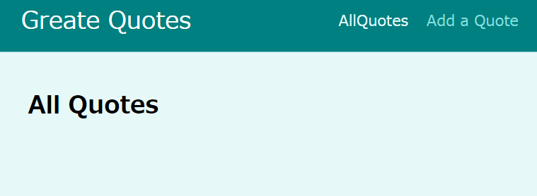
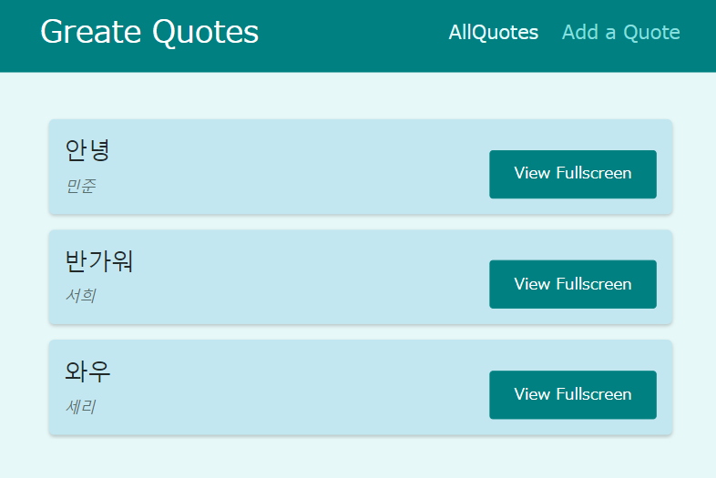

# Router 실전

Quote 리스트를 출력하고, 클릭하면 디테일한 내용을 보고, 등록도 할 수 있는 애플리케이션을 구축해보자.

## 세팅

_index.js_
```js
import ReactDOM from 'react-dom';
import { BrowserRouter } from 'react-router-dom';

import './index.css';
import App from './App';

ReactDOM.render(
  <BrowserRouter>
    <App />
  </BrowserRouter>, 
  document.getElementById('root')
);
```

`BrowserRouter`로 앱을 감싸야 시작할 수 있는 것을 잊지말자.

_App.js_
```js
import { Redirect, Route, Switch } from 'react-router-dom';

import AllQuotes from './pages/AllQuotes';
import NewQuote from './pages/NewQuote';
import QuoteDetail from './pages/QuoteDetail';

function App() {
  return (
    <Switch>
      <Route path='/' exact>
        <Redirect to='/quotes' />
      </Route>
      <Route path='/quotes' exact>
        <AllQuotes />
      </Route>
      <Route path='/quotes/:qutoeId'>
        <QuoteDetail />
      </Route>
      <Route path='/new-quote'>
        <NewQuote />
      </Route>
    </Switch>
  );
};

export default App;
```

첫번째 페이지는 무조건 리스트로 가게 해놓자.

이제 페이지들을 구성해보자.

## 중첩경로 심화

`QuoteDetail`에서는 댓글을 달 수있는 페이지와 연결을 하도록 로직을 짜자

_/pages/QuoteDetail.js/_
```js
import { Fragment } from "react";
import { useParams, Route } from "react-router-dom";

import Comments from '../components/comments/Comments';

const QuoteDetail = () => {

  const params = useParams();

  return ( 
    <Fragment>
      <p>{params.qutoeId}</p>
      <h1>Quote Detail Page</h1>
      <Route path={`/quotes/:quoteId/comments`}>
        <Comments />
      </Route>
    </Fragment>
  );
}

export default QuoteDetail;
```
---
## 레이아웃 컴포넌트

전체 위에 네비게이션 바를 추가해보자.

_MainNavigation.js_
```js
import { NavLink } from 'react-router-dom';
import classes from './MainNavigation.module.css';

const MainNavigation = () => {
  return ( 
    <header className={classes.header}>
      <div className={classes.logo}>Greate Quotes</div>
      <nav className={classes.nav}>
        <ul>
          <li>
            <NavLink 
              to='/quotes'
              activeClassName={classes.active}>
                AllQuotes
              </NavLink>
          </li>
          <li>
            <NavLink 
              to='/new-quote'
              activeClassName={classes.active}>
                Add a Quote
              </NavLink>
          </li>
        </ul>
      </nav>
    </header>
  );
}

export default MainNavigation;
```

`NavLink`로 네비게이션 바안에 링크를 넣었다.

네비게이션 + main으로 감싸는 `Layout.js`를 만들자.

_Layout.js_
```js
import { Fragment } from "react";
import classes from './Layout.module.css';
import MainNavigation from "./MainNavigation";

const Layout = (props) => {
  return ( 
    <Fragment>
      <MainNavigation />
      <main className={classes.main}>{props.children}</main>
    </Fragment>
  );
}

export default Layout;
```

이후 `App.js`를 다 감싸준다.

```js
...
function App() {
  return (
    <Layout>
      <Switch>
        ...
      </Switch>
    </Layout>
  );
}
...
```

이러면 레이아웃이 감싼채로 실행이 된다.



---

## 더미데이터 추가

_AllQuotes.js_
```js
import QuoteList from '../components/quotes/QuoteList';

const DUMMY_QUOTES = [
  { id: 'q1', author: '민준', text: '안녕'},
  { id: 'q2', author: '서희', text: '반가워'},
  { id: 'q3', author: '세리', text: '와우'},
]

const AllQuotes = () => {
  return (
    <QuoteList quotes={DUMMY_QUOTES} />
  );
}

export default AllQuotes;
```


이제 리스트가 출력이 된다!

그러면 입력양식을 만들어보자. 
_NewQuote.js_
```js
import QuoteForm from '../components/quotes/QuoteForm'

const NewQuote = () => {
  const addQuoteHandler = (quoteData) => {
    console.log(quoteData)
  }
  return <QuoteForm onAddQoute={addQuoteHandler} />;
}

export default NewQuote;
```
이제 버튼을 클릭하면 전체 링크로 가도록 논리를 짜보자.

`QuoteItem.js`의 논리에서 `<a>`를 `Link`로 바꾸자.

_QuoteItem.js_
```js
import { Link } from 'react-router-dom';

import classes from './QuoteItem.module.css';

const QuoteItem = (props) => {
  return (
    <li className={classes.item}>
      <figure>
        <blockquote>
          <p>{props.text}</p>
        </blockquote>
        <figcaption>{props.author}</figcaption>
      </figure>
      <Link className='btn' to={`/quotes/${props.id}`}>
        View Fullscreen
      </Link>
    </li>
  );
};

export default QuoteItem;
```
이제 `QuoteDetail.js`도 수정하자

링크를 클릭할때마다 자세한 게시물을 표시하게 하고, 만약 부정확한 링크를 표시할 경우 오류를 내는 로직을 넣자.

_QuoteDetail.js_
```js
import { Fragment } from "react";
import { useParams, Route } from "react-router-dom";

import HighlightedQuote from '../components/quotes/HighlightedQuote';
import Comments from '../components/comments/Comments';

const DUMMY_QUOTES = [
  { id: 'q1', author: '민준', text: '안녕'},
  { id: 'q2', author: '서희', text: '반가워'},
  { id: 'q3', author: '세리', text: '와우'},
];

const QuoteDetail = () => {
  const params = useParams();

  const quote = DUMMY_QUOTES.find((quote) => quote.id === params.quoteId);

  if (!quote) {
    return <p>No quote found!</p>
  };

  return (
    <Fragment>
      <HighlightedQuote text={quote.text} author={quote.author} />
      <Route path={`/quotes/${params.quoteId}/comments`}>
        <Comments />
      </Route>
    </Fragment>
  );
};

export default QuoteDetail;
```

---

## 오류 페이지 만들기

_App.js_
```js
import { Redirect, Route, Switch } from 'react-router-dom';

import AllQuotes from './pages/AllQuotes';
import NewQuote from './pages/NewQuote';
import QuoteDetail from './pages/QuoteDetail';
import Layout from './components/layout/Layout';
import NotFound from './pages/NotFound';

function App() {
  return (
    <Layout>
      <Switch>
        <Route path='/' exact>
          <Redirect to='/quotes' />
        </Route>
        <Route path='/quotes' exact>
          <AllQuotes />
        </Route>
        <Route path='/quotes/:quoteId'>
          <QuoteDetail />
        </Route>
        <Route path='/new-quote'>
          <NewQuote />
        </Route>
        <Route path='*'>
          <NotFound />
        </Route>
      </Switch>
    </Layout>
  );
}

export default App;
```

`Route path='*'`는 모든 path에 있어서 이 컴포넌트를 대입하겠다는 뜻인데, 이걸 맨 아래로 놨기 때문에 지정한 url이외의 모든 url을 다 놓겠다는 의미가 된다.

---

## 제출 시 리다이렉트

우리는 form을 제출하면 자동적으로 url을 이동하는 논리가 필요하다

따라서 router의 useHistory를 쓴다

`history`에서 다른 url로 이동할 시 `push`와 `replace`로 나뉘게 되는데 replace는 리디렉션이라서 페이지를 변경하는거라 뒤로갈 수 없고 push는 새 페이지를 추가하는 것이라 가능하다.

_NewQuote.js_
```js
import { useHistory } from 'react-router-dom'

import QuoteForm from '../components/quotes/QuoteForm'

const NewQuote = () => {
  const history = useHistory();

  const addQuoteHandler = (quoteData) => {
    console.log(quoteData);
    history.push('/quotes');
  }
  return <QuoteForm onAddQuote={addQuoteHandler} />;
}

export default NewQuote;
```
---

## Prompt로 원치않는 경로 전환 방지

다 작성하지 않았는데 페이지를 나가려고 했을때 방지하는 로직을 넣어보자.

먼저 생각해야할 건 우리가 form에 클릭하고 작성을 시작할 때를 기준으로 들어가고 나가고가 결정되어야 한다.

따라서 이 기준을 `onFocus`로 잡고, state를 이용해 Boolean값을 바꾸는것으로 한다.

이후 `Prompt`를 이용해 when은 url을 변환할때인 state의 변화값, 그리고 message에는 함수형으로 변화하는 값을 넣어준다. 왜냐하면 우리는 어떠한 위치 객체를 얻고 그 값을 통해 전달하는 것이기 때문이다.

_QuoteForm.js_
```js
import { Fragment, useRef, useState } from 'react';
import { Prompt } from 'react-router-dom';

import Card from '../UI/Card';
import LoadingSpinner from '../UI/LoadingSpinner';
import classes from './QuoteForm.module.css';

const QuoteForm = (props) => {
  const [isEntering, setIsEntering] = useState(false);

  const authorInputRef = useRef();
  const textInputRef = useRef();

  function submitFormHandler(event) {
    event.preventDefault();

    const enteredAuthor = authorInputRef.current.value;
    const enteredText = textInputRef.current.value;

    // optional: Could validate here

    props.onAddQuote({ author: enteredAuthor, text: enteredText });
  }

  const finishEnteringHandler = () => {
    setIsEntering(false);
  };

  const formFocusedHandler = () => {
    setIsEntering(true);
  };

  return (
    <Fragment>
      <Prompt
        when={isEntering}
        message={(location) =>
          'Are you sure you want to leave? All your entered data will be lost!'
        }
      />
      <Card>
        <form
          onFocus={formFocusedHandler}
          className={classes.form}
          onSubmit={submitFormHandler}
        >
          {props.isLoading && (
            <div className={classes.loading}>
              <LoadingSpinner />
            </div>
          )}

          <div className={classes.control}>
            <label htmlFor='author'>Author</label>
            <input type='text' id='author' ref={authorInputRef} />
          </div>
          <div className={classes.control}>
            <label htmlFor='text'>Text</label>
            <textarea id='text' rows='5' ref={textInputRef}></textarea>
          </div>
          <div className={classes.actions}>
            <button onClick={finishEnteringHandler} className='btn'>Add Quote</button>
          </div>
        </form>
      </Card>
    </Fragment>
  );
};

export default QuoteForm;
```
---

## 쿼리 매개변수(parameter)

일반 매개변수와 다르게 쿼리 매개변수는 필수가 아님. 

쿼리 매개변수는 로드된 페이지의 `행동`을 바꾼다.

예를들어 인용문을 id에 따라 오름차순, 내림차순으로 정렬하는 등의 행동을 말한다.

따라서 이번엔 `QuoteList.js`에서 리스트의 오름차순과 내림차순을 만들어보겟다.

`useLocation`을 통해 쿼리 파라미터를 가져온 다음에, 이것을 JS에 내장되어 있는 `URLSearchParams`로 값을 뽑아낸다.

그 값은 boolean으로 정하여서 버튼을 누를때마다 참거짓 판독으로 삼항연산자를 사용해 오름차 내림차를 변하게 만든다.

이후 `useHistory`를 통해, push해 url로 보내는 로직이다. 

```js
import { Fragment } from 'react';
import { useHistory, useLocation } from 'react-router-dom';

import QuoteItem from './QuoteItem';
import classes from './QuoteList.module.css';

const sortQuotes = (quotes, ascending) => {
  return quotes.sort((quoteA, quoteB) => {
    if (ascending) {
      return quoteA.id > quoteB.id ? 1 : -1;
    } else {
      return quoteA.id < quoteB.id ? 1 : -1;
    }
  });
};

const QuoteList = (props) => {
  const history = useHistory();
  const location = useLocation();

  const queryParams = new URLSearchParams(location.search);

  const isSortingAscending = queryParams.get('sort') === 'asc';

  const sortedQuotes = sortQuotes(props.quotes, isSortingAscending);

  const changeSortingHandler = () => {
    history.push('/quotes?sort=' + (isSortingAscending ? 'desc' : 'asc'));
  };

  return (
    <Fragment>
      <div className={classes.sorting}>
        <button onClick={changeSortingHandler}>
          Sort {isSortingAscending ? 'Descending' : 'Ascending'}
        </button>
      </div>
      <ul className={classes.list}>
        {sortedQuotes.map((quote) => (
          <QuoteItem
            key={quote.id}
            id={quote.id}
            author={quote.author}
            text={quote.text}
          />
        ))}
      </ul>
    </Fragment>
  );
};

export default QuoteList;
```
---

## 코멘트 만들기 / 네스트 라우터

`useRouteMatch` 주도적으로 사용하기.


