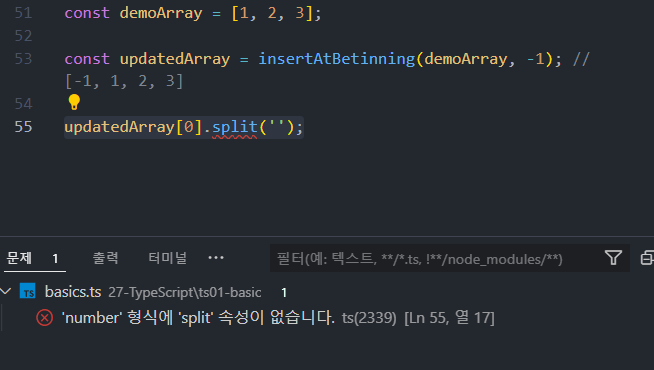
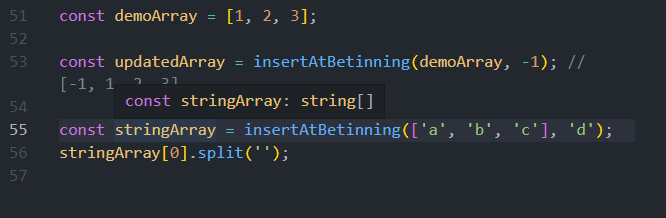

# TypeScript

## 목표

1. TypeScript는 무엇이고 왜 사용해야 하는가
2. TypeScript의 기본 내용
3. React + TypeScript

---

## TypeScript는 무엇이고 왜 사용해야 하는가

**JavaScipt의 superset 언더**

가장 중요한 건 `정적 타입(statically Typed)`의 특징을 갖는다.

그러면 왜 이걸 사용해야하는가?

```js
function add(a, b) {
  return a + b;
}

const result = add(2, 5);

console.log(result);
// 7
```

이런 값이 나오는 js가 있다고 생각해보자.

여기서 두개의 값은 number형이다. js는 `동적 타입 언어`이므로 자동으로 이걸 알고 있다.

즉 함수는 사용할 타입을 미리 정해두지도 않은 상태에서 전달된 매개 변수를 받아 코드를 실행한다. 그럼 만약 이렇게 하면 어떻게 되는가?

```js
function add(a, b) {
  return a + b;
}
const result = add('2', '5');
console.log(result);
// 25
```
이렇게 나타난다. 당연하다 왜냐하면 형이 바뀌었기 때문.

하지만 이건 오류를 발생할 위험이 있다.

많은 사람들이 동일한 코드 베이스에서 작업을 할 것이기 때문에 함수나 객체를 의도치 않은 방식으로 사용하는 일이 발생할 수 있다.

따라서 이 함수는 이렇게 사용하면 안된다고 제시해야한다.

타입스크립트는 이걸 해결해준다., 
```ts
function add(a: number, b: number) {
  return a + b;
}
const result = add(2, '5);

console.log(result);
```

타입스크립트를 사용하면 `컴파일러`를 사용할 수 있다는게 중요하다는 것.

왜냐하면 타입스크립트는 브라우저에서 실행되지 않기 때문에 TS를 JS로 컴파일해야한다. 컴파일이 진행되면 타입표기는 모두 삭제된다. 

하지먼 컴파일을 진행하며 오류들을 찾아 알려줄 것이다.

방식은 npx tsc

---

## Types

### 기본형(Primitives)

- number
- string
- boolean
- null
- undeffined
- symbol

```ts
let age: number;

age = 12;

age = '12';
// 오류

let userName: string;

userName = 'Hi';

let isInstructor: boolean;

isInstructor = true;

// null과 undefined는 더 실용적인 부분에서 다시 설명.
```

### More Complex types

1. array
2. object

```ts
let hobbies: string[];
// 문자열 배열 타입

hobbies = ['hi', 'lol', 'yeah'];
// hobbies = [1, 2, 3]; 오류

let annie: any; // any를 입력하지 않아도 자동으로 지정이 됨.
// let annie; 과 동일한 논리! 

let person: {
  name: string;
  age: number;
};

person = {
  name: 'hi',
  age: 532
};

/*
오류
person = {
  isDied: trey
}
*/

let people: {
  name: string;
  age: number;
}[];
// 객체 배열
```

### Type 추론 (Type Inference)

```ts
let course = 'React';

course = 343; //오류 발생! 왜?
```

타입 추론 때문에!

기본적으로 ts는 타입을 유추하려 하는데 어떤 타입을 어디에 사용해야할지 알아내려 함.

따라서 우리는 처음부터 타입을 지정하지 않고 타입추론을 사용하는것이 좋음. 왜냐하면 코드가 절약되기 때문에.

### Union Type

다양한 타입을 여러개 저장하는 경우

하나의 변수에 string과 number를 같이 저장할때가 예가 될 수 있음.

이럴때 쓰는것이 `Union Type`

```ts
let hello: string | number = 'hi';

hello = 213132;
// 둘다 가능해짐.
```
값과 타입을 유연하게 작성 가능해짐.

### Type Alias

타입스크립트 코드를 작성하다 보면 어느 시점부터는 동일한 타입을 반복해서 정의하는 일이 많아진다.

```ts
let person: {
  name: string;
  age: number;
};

let people: {
  name: string;
  age: number;
}[];

```
이런 경우

따라서 우리는 직접 기본(Base) 타입을 만들어 거기에 복잡한 타입을 정의해 두고 그 타입 별칭을 사용한다.

이것이 바로 `Type Alias`

이건 ts에서만 있기 때문에 js로 컴파일 되면 자연스럽게 사라진다.

```ts
type Person = {
  name: string;
  age: number;
}

let person: Person;

person = {
  name: 'hi',
  age: 532
};

let people: Person[];
```

코드가 절약되고 관리하기도 쉬워진다.

### Functions & Type

```ts
function add(a: number, b: number) {
  return a + b;
}
```
이렇게 짜면 자동으로 return으로 나타날 값을 타입 추론을 통해 나타내준다.

물론 이렇게 정해줄 수 있다.

```ts
function add(a: number, b: number): number {
  return a + b;
}
```

따라서 ts를 사용할때는 매개변수의 타입 뿐 아니라 반환값의 타입도 생각해야한다.

만약 반환하는것이 하나도 없다면 void를 반환한다.

```ts
function printOutput(value: any) {
  console.log(value);
}
```

## Generics (제네릭)

```ts
function insertAtBetinning(array: any[], value: any) {
  const newArray = [value, ...array];
  return newArray;
}

const demoArray = [1, 2, 3];

const updatedArray = insertAtBetinning(demoArray, -1); // [-1, 1, 2, 3]
```
이렇게 배열의 가장 첫번째에 값을 넣어주는 함수를 짰다고 생각해보자.

여기서 가장 문제는 `updatedArray`의 배열이 any로 설정이 되는 것이다. 왜냐하면 TS는 `demoArray`에 숫자만 들어간 것을 모른다. 왜냐면 함수에서 any를 사용하기로 했기 때문이다.

그렇다고 함수를 바꾸자니 다른 곳에서 또 필요할 수 있다. 

이렇게 되면 `updatedArray`는 any객체가 들어가 있는 배열로 ts가 정했기때문에 ts의 도움을 받을 수 없다. 사실상 js의 일반적인 배열과 똑같은 것이다.

```ts
const updatedArray = insertAtBetinning(demoArray, -1); // [-1, 1, 2, 3]

updatedArray[0].split('');
```
이렇게 string에서만 이용하는 함수도 오류를 잡아주지 않는다.

따라서 우리는 이런 문제를 해결하기 위해 제네릭을 사용한다.

```ts
function insertAtBetinning<T>(array: T[], value: T) {
  const newArray = [value, ...array];
  return newArray;
}
```
이렇게 짜게 된다면 array는 항상 T 타입 값으로만 채워질 테고, value또한 T만 가능할 것이다.



이제 `updatedArray`가 number로만 채워진 값이라는 것을 인식하고, number가 아니므로 오류를 내뿝는다.

마찬가지로 string 배열을 짜게 되더라도 같은식으로 string만 들어간 것을 인식하게 된다.




이러한 제네릭은 타입 안정성과 유연성을 준다. 어떤 타입이든 사용 가능하지만, 특정 타입을 사용해 함수를 실행하면 해당 타입으로 고정되어 동작하게 된다.


